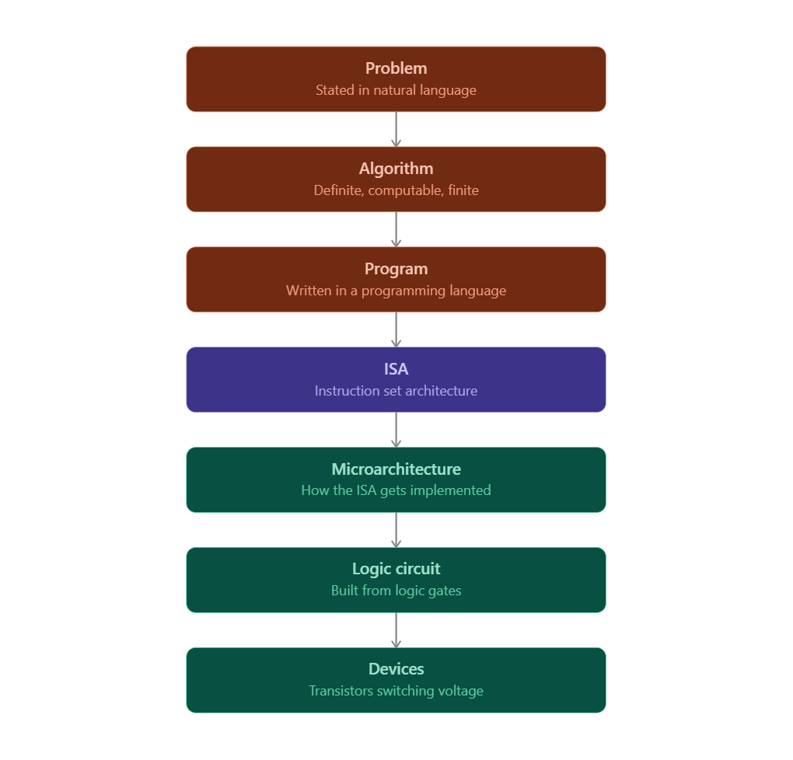

## The one sentence that matters most
# a computer has no magic in it.
It is not clever. It is not thinking. It is what the authors bluntly call an "electronic idiot" — it does exactly what it's told, every single time, given the same input. Hit it the same way twice, get the same result twice. Always. No exceptions, no moods, no creativity.

That might sound obvious, but it's actually the single most useful mental habit you can build as a programmer. When your code does something weird, the instinct to blame "the computer being weird" is wrong 100% of the time. Something specific and traceable happened. Your job — the whole point of learning what's underneath your code — is to be able to trace it.