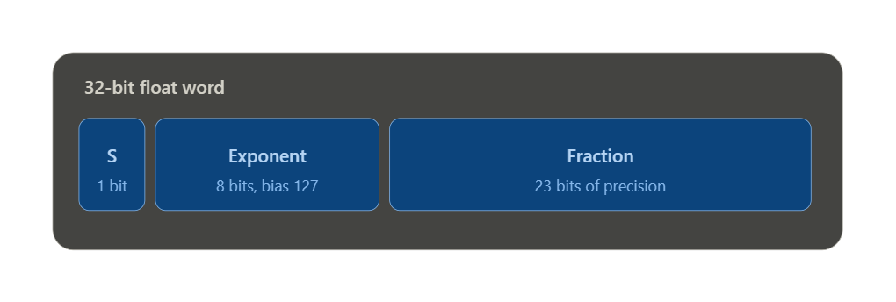

## 1. What exactly is a bit, and what's a "data type"?
A bit (short for binary digit) is the smallest unit of information a computer stores — it's just: is there a voltage on this wire, or isn't there? We write "1" for voltage-present and "0" for voltage-absent. One bit alone can only distinguish between two things. But bits combine: with k bits, you can produce 2^k distinct patterns. Eight bits gives you 256 possible patterns; sixteen bits gives you 65,536. This one fact — 2^k patterns from k bits — underlies almost everything else in this chapter.

a data type is not just a representation — it's a representation plus a defined set of operations the hardware knows how to perform on it. A bit pattern by itself means nothing. The same 8 bits 01000001 could be the number 65, or the letter A, or something else entirely — it's only a specific data type once you've paired that pattern with an agreed interpretation and a set of legal operations. This is exactly why C forces you to declare int x versus char c versus float f for the same-sized chunk of memory — you're not describing different amounts of storage, you're telling the compiler which operations and interpretation apply to those bits.

## 2. Representing whole numbers
Unsigned integers are the easy case — plain positional binary, same idea as decimal but base 2 instead of base 10. Just like 329 in decimal means 3×10² + 2×10¹ + 9×10⁰, the binary string 00101 means 0×2⁴ + 0×2³ + 1×2² + 0×2¹ + 1×2⁰ = 5.

But real arithmetic needs negative numbers too, and this is where it gets genuinely interesting. There were two obvious-seeming first attempts at representing negatives, and both turned out to be mistakes:

- Signed magnitude — use the leftmost bit purely as a sign flag (0 = positive, 1 = negative), and the rest of the bits for the magnitude. Simple to read, but it creates an annoying problem: there's a +0 (00000) and a separate −0 (10000) — two different bit patterns that are supposed to mean the same value.

- 1's complement — negate a number by simply flipping every bit. +5 is 00101, so −5 is 11010. Cleaner conceptually, but it has the same two-zeros problem, and it turns out to be annoying for hardware to add.

The representation that actually won, and that essentially every computer on Earth uses today, is 2's complement. Here's the trick to negate a number in 2's complement: flip every bit, then add 1.

- +5 = 00101
- Flip all bits → 11010
- Add 1 → 11011 — and that's −5.

Why did this specific scheme win, when it seems like an arbitrary extra step (flip and add 1)? Here's the beautiful engineering reason, and it's worth really sitting with because it's a perfect example of "hardware and software shaping each other," which is exactly the theme Chapter 1 was setting you up for: 2's complement was designed backward from the adder circuit. Computer designers already had to build a circuit that adds two binary numbers (called an ALU — arithmetic and logic unit). They wanted negative numbers to "just work" with that same adder, with no separate subtraction circuit needed at all.

Check it: if A − B is really just A + (−B), then all you need is a fast way to compute −B, and then subtraction is free — it's just addition. That's precisely what 2's complement gives you: negation is a fixed, cheap operation (flip + add 1), and afterward, plain addition produces the correct answer every time — the ALU doesn't even need to know or care whether the numbers are positive or negative. It just adds bit patterns. This is a genuinely elegant piece of design, and it's why, deep in a modern CPU, there is no dedicated "subtractor" circuit — subtraction rides for free on the adder.

Range: with k bits in 2's complement, you can represent integers from −2^(k−1) to +2^(k−1) − 1. Notice the asymmetry — one more negative number than positive. (With 5 bits, that's −16 to +15, not −15 to +15.) That extra negative slot exists because of how the leftover, unassignable bit pattern gets handed to the "most negative" value rather than being wasted.

## 3. Converting between binary and decimal
Binary → decimal: look at the leftmost bit. If it's 0, the number is positive — just add up the powers of 2 wherever there's a 1. If it's 1, the number is negative — first flip all bits and add 1 to find its positive magnitude, sum the powers of 2 for that, then slap a minus sign on the front.

Worked example: what does 11000111 represent?
Leftmost bit is 1 → negative. Flip and add 1: flip → 00111000, add 1 → 00111001. That's 32+16+8+1 = 57. So 11000111 represents −57.

Decimal → binary: the cleanest mental version of this is repeated division by 2, keeping the remainders: divide the number by 2, write down the remainder (0 or 1) — that's your next bit, working from the rightmost bit outward. Keep dividing the quotient by 2 until it hits 0.

Fractional binary numbers work the same way but mirrored: to convert a binary fraction like .1011 to decimal, add up 0.5 (for the first bit), 0.125 (third bit), and 0.0625 (fourth bit) → 0.6875. Going the other way (decimal fraction → binary), you repeatedly multiply by 2 and peel off whichever digit lands left of the decimal point each time.