## What is Transistor?
an electrically controlled switch

the transistor has three terminals:

```
        Gate
          │
          │
       ┌─────┐
       │     │
Source │     │ Drain
       └─────┘
```

The important terminal for us is the :
Gate

because the voltage applied to the gate controls whether the path between source and drain is effectively connected.


## N-type transistor

The book introduces two types:

N-type
P-type


The simplified behavior is:

N-type:

Gate = 1
   ↓
Source-Drain path CLOSED

Gate = 0
   ↓
Source-Drain path OPEN

```
N-type

       gate
         │
         ▼
      ┌──────┐
  ────┤      ├────
      └──────┘

1 → switch ON
0 → switch OFF
```

## P-type transistor
behaves opposite

```
P-type:

Gate = 0
   ↓
Source-Drain path CLOSED

Gate = 1
   ↓
Source-Drain path OPEN
```


## Why do we have both N and P?

Because together they allow us to build extremely useful circuits where:
```
one path pulls output HIGH
another path pulls output LOW
```

And they can be arranged so that the output always gets a strong, well-defined logical value.

Circuits built using complementary P-type and N-type transistors are called CMOS circuits.

CMOS means:
Complementary Metal-Oxide Semiconductor.

```
CMOS
=
P-type + N-type
```

## Our first real logic gate : NOT
the CMOS inverter uses:

```
1 P-type transistor
+
1 N-type transistor
```

```
            Vcc
             │
       |---P-type
       |     │
 In ---|     ├──── OUT
       |     │
       |---N-type
             │
           Ground
```

Input = 0

P-type sees:
0

P-type turns ON.

N-type sees:
0

N-type turns OFF.

So:

Vcc
 │
P ON
 │
OUT

Output is connected to the high voltage.

Therefore:
```
IN  = 0
OUT = 1
9. Input = 1
```

Now:

P-type → OFF
N-type → ON

So:
```
OUT
 │
N ON
 │
Ground
```
Output is pulled low.

Therefore:
```
IN  = 1
OUT = 0
```
So:

0 → 1
1 → 0

we have physically build: NOT


## This is abstraction happening again

At first we cared about:
```
P-type transistor
N-type transistor
voltages
```

```
      ┌─────┐
IN ───┤ NOT ├─── OUT
      └─────┘
```

## NOR logic gate
```
             Vdd (+5V)
               │
             ┌─┴─┐
    Input A ─┤Q1 │ (PMOS)
             └─┬─┘
               │
             ┌─┴─┐
    Input B ─┤Q2 │ (PMOS)
             └─┬─┘
               │
               ├─────── Output Y
               │
       ┌───────┴───────┐
       │               │
     ┌─┴─┐           ┌─┴─┐
    ─┤Q3 │          ─┤Q4 │ (NMOS)
     └─┬─┘           └─┬─┘
       │               │
       └───────┬───────┘
               │
             Ground (0V)
```

```
[POWER & GROUND]
- Vdd    -> Connected to Source of Q1 (PMOS)
- Ground -> Connected to Source of Q3 (NMOS) and Source of Q4 (NMOS)

[PMOS SERIES NETWORK]
- Q1 Source -> Vdd (+5V)
- Q1 Drain  -> Q2 Source
- Q2 Drain  -> Output Y

[NMOS PARALLEL NETWORK]
- Q3 Drain  -> Output Y
- Q4 Drain  -> Output Y
- Q3 Source -> Ground (0V)
- Q4 Source -> Ground (0V)

[INPUT CONTROL]
- Input A   -> Connected to Gate of Q1 (PMOS) and Gate of Q3 (NMOS)
- Input B   -> Connected to Gate of Q2 (PMOS) and Gate of Q4 (NMOS)
```

## OR
```
NOR
+
NOT
```

```
A ──┐
    ├── NOR ── NOT ── OUT
B ──┘
```

## AND and NAND


```
A	B	AND	NAND
0	0	0	1
0	1	0	1
1	0	0	1
1	1	1	0
```

### A logical operation is not magic. It is caused by physical connectivity.


## Logical design isn't the whole story

It is possible to design a transistor arrangement that looks logically correct but produces unacceptable electrical voltage levels.

For example, directly connecting certain P-type/N-type arrangements can produce intermediate voltages such as roughly 0.7 V or 1.0 V instead of clean logical 0 and 1 levels.

This is a very important engineering lesson:

  ### A circuit must work electrically, not merely look logically correct on paper.

That's why computer engineering exists at the boundary of:
```
logic
+
electronics
```


## Combinational logic
A combinational circuit has:
  ### outputs determined only by the inputs that exist right now.

There is no memory of what happened earlier.

```
INPUT
  ↓
┌──────────────┐
│ combinational│
│    logic     │
└──────────────┘
  ↓
OUTPUT
```
No memory
No history


### Simple example

Suppose:
```
A = 1
B = 0
```

and circuit is:
```
A AND B
```

output:
```
0
```

If A changes:
```
A = 1 → 0
```

the output changes according to the new inputs.

The circuit doesn't remember:
```
“A used to be 1.”
```

That's combinational logic.


## First major combinational structure: Decoder
A decoder takes a binary pattern and identifies which pattern it is.

for example , 2 input bits:
```
AB
```

have four possibilities
```
00
01
10
11
```

A 2-to-4 decoder produces four outputs:
```
D0
D1
D2
D3
```
Exactly one is active at a time.

Like this:
```
Input 00 → D0 = 1
Input 01 → D1 = 1
Input 10 → D2 = 1
Input 11 → D3 = 1
```

The book describes the general rule:
```
n inputs → 2ⁿ outputs
```
with exactly one output asserted for each input pattern.


### why decoder is useful?
Think about address

suppose we have four memory locations:
```
Address 00 → location 0
Address 01 → location 1
Address 10 → location 2
Address 11 → location 3
```

The decoder takes:
```
10
```

and effectively says:
   Select location 2


Only that line becomes active.

That turns out to be exactly what we need when building memory.

So a decoder is essentially:

#### “Which one?”


## Decoder and CPU instructions
The LC-3 instruction contains a four-bit opcode

A 4-to-16 decoder can examine that opcode and determine which operation is being requested.

Conceptually:
```
opcode
  ↓
decoder
  ↓
"Which instruction is this?"
  ↓
activate corresponding control logic
```

So a decoder becomes part of the processor's control mechanism.


## Second major structure: MUX
Mux stands for :
# Multiplexer

Think of mux as:
   ### a digital selector

suppose you have:
```
A ─────┐
       │
       ├── MUX ─── OUT
       │
B ─────┘
```

and:
```
S = select
```

Then:
```
S = 0 → OUT = A
S = 1 → OUT = B
```

the select signal determines which input is connected to the output


## Mux mental model

Think of a railway switch:
```
Track A ──┐
          ├──── OUT
Track B ──┘
```

The selector decides which track gets connected

so:
```
Decoder
= Which one?

MUX
= Choose one.
```

## Why are MUXes important in computers?
Because a computer constantly has multiple possible sources for data.

For example:
```
Should the ALU receive:
    data from register A?

or:
    a constant?

or:
    something from another path?
```

A MUX can select the correct source.

That's why the LC-3 datapath contains multiple MUXes


### Larget muxes
A 2-to-1 mux:


```
2 inputs
1 select bit
```

A 4-to-1 mux:


```
4 inputs
2 select bits
```

Why?

Because:
```
2² = 4
```

The select bits identify one of four inputs.

An 8-to-1 mux would need:
```
2³ = 8
```

so:
```
3 select bits
```


## Building an adder
### How do we physically build the circuit that adds binary numbers

Remember:
```
  1
+ 1
---
 10
```

Each column needs to consider:
```
A bit
B bit
carry from previous column
```

So there are three inputs:
```
A
B
Cin
```

and two outputs:
```
Sum
Cout
```

The book calls this a one-bit adder, traditionally a full adder.

### 28. Let's understand the full adder intuitively

Suppose:


```
A = 0
B = 0
Carry in = 0
```

Then:
```
0 + 0 + 0 = 0
```

So:
```
Sum = 0
Carry = 0
```

Suppose:
```
0 + 1 + 0 = 1
```

Therefore:
```
Sum = 1
Carry = 0
```

Suppose:
```
1 + 1 + 0 = 2
```

Binary 2 is:
```
10
```

Therefore:
```
Sum = 0
Carry = 1
```

Suppose:
```
1 + 1 + 1 = 3
```

Binary 3:
```
11
```

Therefore:
```
Sum = 1
Carry = 1
```

### 29. Put four one-bit adders together

Suppose we want:


```
A = 1011
B = 0011
```

We need four one-bit adders:
```
bit 0 → adder
bit 1 → adder
bit 2 → adder
bit 3 → adder
```

The carry from one goes into the next:
```
             carry
              ↓
       ┌────────────┐
A0 ────►│ 1-bit     │── Sum0
B0 ────►│ adder      │
       └─────┬──────┘
             │
             ↓ carry

       ┌────────────┐
A1 ────►│ 1-bit     │── Sum1
B1 ────►│ adder      │
       └─────┬──────┘
             │
             ↓

             ...
```

The book explicitly shows a four-bit adder constructed from four one-bit adders.

And therefore:
```
16-bit adder
=
16 one-bit adders
```

#### Large complex systems can be constructed from simple components

```
transistors
   ↓
gates
   ↓
one-bit adder
   ↓
4-bit adder
   ↓
16-bit adder
   ↓
ALU
```

#### Build something big by systematically combining small understandable pieces


## 31. PLA — Programmable Logic Array

What if I want to implement arbitrary logical functions?

A PLA gives us a structured way of doing that.

The simplified structure is:
```
inputs
  ↓
AND array
  ↓
OR array
  ↓
outputs
```

The book explains that for n inputs, the AND array can represent the possible input combinations, and connections to the OR array determine which combinations make each output become 1.

“Build the truth table directly into hardware.”


## 32. Why is PLA called programmable?
Not “programmable” in the same sense as writing a C program.

Instead, you determine:
```
which AND outputs connect
to
which OR inputs
```

Those connections define the desired logical functions.

```
truth table
   ↓
choose connections
   ↓
circuit implements function
```

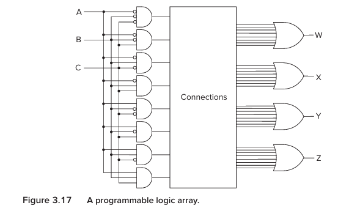


## 33. Logical completeness
```
AND
OR
NOT
```
are logically complete.

meaning:
   with enough AND , OR, and NOT gates, you can build a circuit implementing any truth table you want.

it means these basic operations are enough as a function for arbitrary combinational logic


## 34. NAND is also logically complete

#### Can we build everything using only NAND?
yes

Because:

### NOT using NAND

Connect both inputs together:
```
A ──┐
    ├── NAND → NOT A
A ──┘
```

Because:
```
A NAND A
=
NOT(A AND A)
=
NOT A
```

Then using NAND plus the NAND-built NOT function, you can construct AND and OR.

```
NAND
   ↓
NOT
   ↓
AND / OR
   ↓
anything
```

This means a single type of gate can serve as a universal building block.


## PART IV — Now comes the huge conceptual jump
Everything so far has been:
COMBINATIONAL

Remember:
output depends on current inputs

But a computer needs to remember things.

For example:
```
What number was I storing?
What instruction am I executing?
What state am I currently in?
```

So we need:
# Storage.


## 35. How can a circuit remember anything?
We use feedback.

Instead of:
```
Input → Circuit → Output
```

we make:
```
           ┌─────────┐
Input ────►│ Circuit │─── Output
           ▲      │
           └──────┘
              feedback
```

The output can help maintain the circuit's current condition.

The result is a circuit that can remain in one of multiple stable states.


## 36. R-S latch
It is made from:
```
two NAND gates
```

whose outputs feed back into each other's inputs.

The latch can store:
```
0
```

or:
```
1
```

that is our first actual memory element


## 37. Why is feedback important?
Imagine the latch is currently storing:
```
1
```
The internal feedback makes the circuit continue producing the conditions necessary to preserve that 1.

Likewise, if it is storing:
```
0
```
the feedback maintains the 0.

So the circuit has:
```
current state
```
rather than merely responding to the current input.


## 38. Set and Reset
The R-S latch has two control inputs:

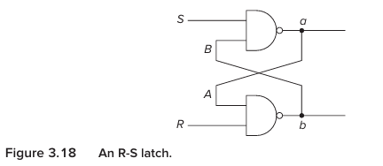

```
S = Set
R = Reset
```

NAND-latch convention:
```
S = 0
R = 1
```

causes it to store:
```
1
```

while
```
S = 1
R = 0
```

causes it to store:
```
0
```

when :
```
S = 1
R = 1
```

the latch simply keeps its current value

this is quiescent state.


## 39. Why can't S and R both be 0?
That creates an invalid condition for this latch.

Both outputs can temporarily become:
```
1
```

and the eventual state becomes dependent on transistor-level electrical behavior rather than the intended logical operation.

For our purposes:
Don't activate Set and Reset simultaneously.


## 40. Gated D latch
The R-S latch isn't convenient enough.

We want something simpler:
“Store this particular bit when I tell you to.”

So we introduce a D latch with:
```
D  = Data
WE = Write Enable
```

The important behavior is:
```
WE = 0
→ don't change stored value

WE = 1
→ store D
```

## 41. Think of the D latch as a box
Forget its internal gates for a moment.

Imagine:
```
        ┌─────────────┐
D ─────►│             │
WE ────►│   D LATCH   │────► Q
        │             │
        └─────────────┘
```

If:
```
WE = 1
```

then:
```
Q <- D
```

if:
```
WE = 0
```

then:
```
Q stays the same
```

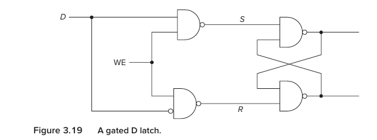


## 42. Why is this different from combinational logic?
Consider an AND gate:
```
A AND B → output
```

if inputs change:
```
output changes
```

There is no "Memory"

But D latch:
```
D = 1
WE = 1
```

stores:
```
1
```

Then:
```
D changes to 0
WE = 0
```

The output can remain:
```
1
```

The previous value matters.

That's the first big difference between:
```
combinational
```

and:
```
storage/sequential
```

## PART V — Memory

## 43. What is memory?

At the basic level:
Memory is a collection of storage locations.

Each location has:
```
an address
```

and:
```
a value
```

the unique identifier of a location as its address, and the number of bits stored in each location as its addressability.

Think of a building:
```
Room 0 → value
Room 1 → value
Room 2 → value
Room 3 → value
```

The room number is analogous to the address.


### 44. Address space
Suppose you have:
```
2 address bits
```

How many unique addresses?
```
2² = 4
```

So:
```
00
01
10
11
```

give:
```
4 locations
```
```
n address bits
→
2ⁿ unique locations
```

### 45. Addressability
Now suppose each location stores:
```
3 bits
```

Then we'd have:
```
4 locations
×
3 bits/location
```
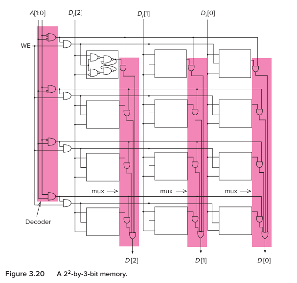

The book's small example is a 2² × 3-bit memory: four locations, each containing three bits.


### 46. Address space vs addressability
Suppose:
```
Address space = 4 locations
Addressability = 3 bits/location
```

### 47. How do we read memory?
Let's say:
```
Address 00 → 101
Address 01 → 011
Address 10 → 110
Address 11 → 001
```

Suppose we request:
```
10
```
How does the hardware find the correct row?

We use a:

# Decoder
```
Address
   ↓
Decoder
   ↓
select one memory row
```

For:
```
10
```
the decoder activates exactly one word line.

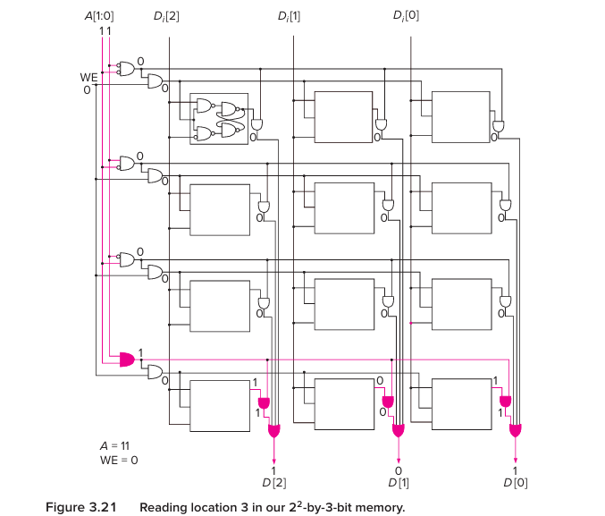


### 48. Then comes the MUX idea
Once the decoder selects one row, the stored bits from that row need to reach the output.

The book's circuit effectively uses AND/OR structures that work like a multiplexer: only the selected row's value gets through.

So memory uses concepts we've already learned:
```
decoder
+
storage elements
+
mux-like selection
```

This is a major theme:

    ### New structures are made from structures you already understand.


### 49. How do we write to memory?
Suppose:
```
Address = 10
Data = 101
WE = 1
```

Then:
```
address
   ↓
decoder
   ↓
select row 10
   ↓
WE asserted
   ↓
write 101 into selected storage elements
```

### 50. A memory operation now makes sense
When a CPU says:
```
“Read memory location X”
```

the hardware effectively needs to:
```
1. Receive address X.
2. Decode X.
3. Select exactly one location.
4. Route that location's stored bits to the output.
```

When it says:
```
“Write value V to location X”
```

it needs to:
```
1. Receive address X.
2. Decode X.
3. Select location X.
4. Assert write enable.
5. Store V there.
```

This will be tremendously useful once we get to actual CPU memory operations.


## PART VI — Sequential Logic

## 51. Combinational vs sequential

# Combinational
```
current inputs
     ↓
  circuit
     ↓
current outputs
```

no memory
no history

examples:
```
AND
OR
MUX
decoder
adder
```
The book defines them as structures whose outputs depend only on the current inputs.

---

# Sequential
```
current inputs ─────┐
                    ↓
                 circuit
                    ↓
                 outputs
                    │
                    ↓
               storage
                    │
                    └──────→ history/state
```

now:
```
current inputs
+
previous state
=
new behavior
```

The book explicitly distinguishes sequential logic by its storage elements and dependence on prior history

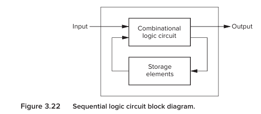

### 52. Real-world example: combination lock
Suppose the correct sequence is:
```
R13
L22
R3
```

The lock cannot simply care about:
```
"What is the dial position right now?"
```

It must know:
```
What happened before?
```

For example, reaching 3 after:
```
R13 → L22 → R3
```

is different from reaching 3 after:
```
R22 → L13 → R3
```

Same final number.
Different history.

Therefore the lock needs memory.
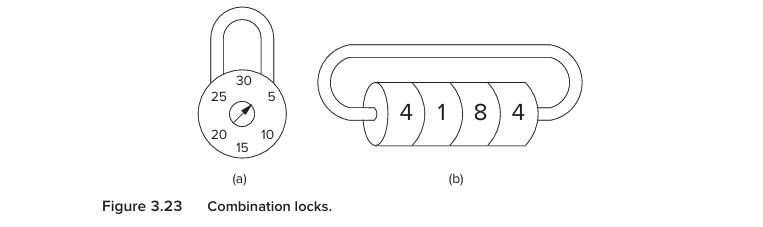

### 53. The concept of state
state as a snapshot containing all relevant information about a system at a particular moment.

suppose you ask:
  what is happening in this game right now?

you might need:
```
score
time remaining
who has the ball
fouls
shot clock
```

together, those values describe the state


### 54. State means “where am I in the process?”
For a combination lock:
```
State A:
nothing correct yet

State B:
R13 completed

State C:
R13 → L22 completed

State D:
R13 → L22 → R3 completed
```

Each state captures:
“Where am I in the process?”

### 55. Another example: vending machine
Suppose a drink costs:
```
15 cents
```

Machine accepts:
```
5-cent
10-cent
```

Possible states:
```
A → 0 or enough money / open
B → 5 cents
C → 10 cents
```

Then:
```
State B + nickel → State C
```

and:
```
State C + nickel → State A
```

because 15 cents has been inserted.


## 56. Finite State Machine
An FSM — Finite State Machine — consists of:

1. finite number of states
2. finite number of inputs
3. finite number of outputs
4. rules for state transitions
5. rules determining outputs.

Think:
```
FSM =
states
+
inputs
+
rules for moving between states
+
outputs
```

That's the core.


### State diagram

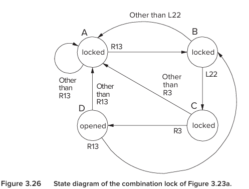

The circles are states.

The arrows are transitions.

The condition/input on the arrow tells us:

    “When this happens, move here.”

### 58. Current state + input → next state
```
Current state = 5 cents
Input = nickel
        ↓
Next state = 10 cents
```

The book explicitly describes next state as being determined by the current state plus current external input.


### 59. Why is it called “finite”?
Because there are only a finite number of states.

A vending machine doesn't need:
```
state 1
state 2
state 3
...
forever
```

It has a finite set of situations it needs to understand.

Similarly, a processor has a finite number of internal state variables and storage elements.


## PART VII — Asynchronous vs Synchronous
## 60. Asynchronous system
Imagine a vending machine.

You insert a coin now.

Then wait:
```
10 seconds
```

Then another coin.
The machine simply waits.
There is no global timing signal saying:

    “Exactly 1 millisecond has passed; now you must change state.”

The book calls this kind of behavior asynchronous.


### 61. Synchronous system
Computers generally use synchronized state transitions.

Think:
```
tick
tick
tick
tick
```
At each clock event, the system moves to its next state.

So:
```
Current state
      ↓
clock event
      ↓
Next state
```

The book emphasizes that computer state transitions occur at identical fixed time intervals.


## 62. What is the clock?
The clock is simply a periodically changing electrical signal.

Conceptually:
```
1 ──────┐      ┌──────┐      ┌──────
        │      │      │      │
0 ──────┴──────┴──────┴──────┴──────→ time
```

Or:
```
0 → 1 → 0 → 1 → 0 → 1
```

Each repeated interval is a:

    clock cycle


### 63. What does 2 GHz mean?
```
2 GHz
=
2 billion clock cycles/second
```

That's:
```
2,000,000,000 cycles/second
```

The corresponding cycle duration is roughly:
```
0.5 nanoseconds
```

in the example.

But be careful with one beginner misconception:

    One clock cycle does not necessarily mean one complete instruction.

The book is preparing us for computer architecture, where an instruction can require multiple internal steps.

The clock is primarily the synchronization mechanism.


### 64. Why do we need the clock?
Because without synchronized storage, state could change unpredictably during the period in which combinational logic is calculating.

imagine:
```
state
 ↓
combinational logic
 ↓
next state
 ↓
state storage
```

If storage changes immediately whenever its input changes, then:
```
new state
 ↓
combinational logic recalculates
 ↓
another new state
 ↓
combinational logic recalculates
 ↓
another new state
...

You could get uncontrolled changes.
```

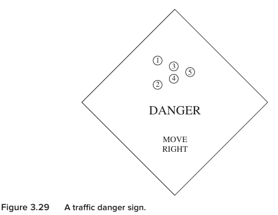

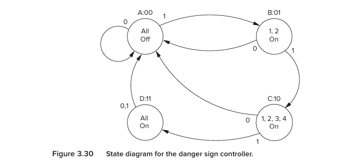

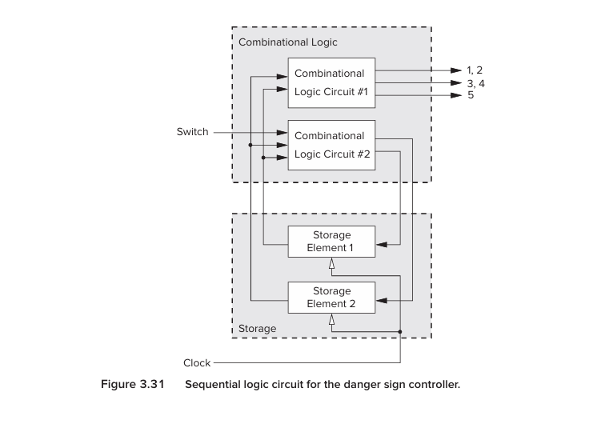

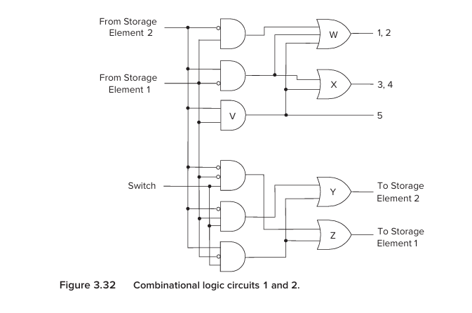