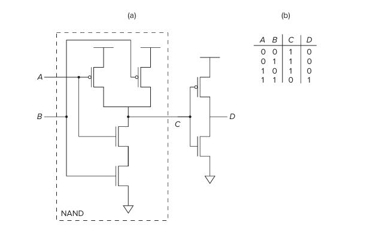
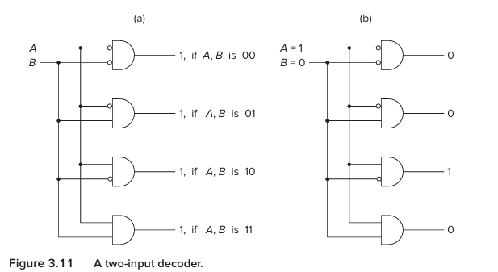
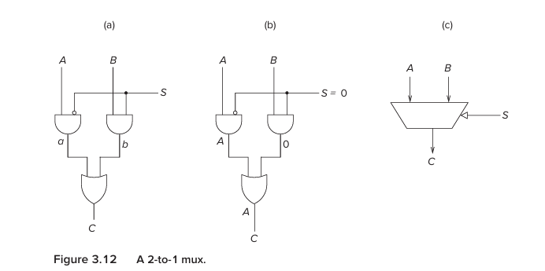
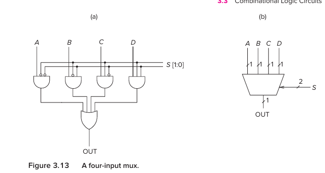
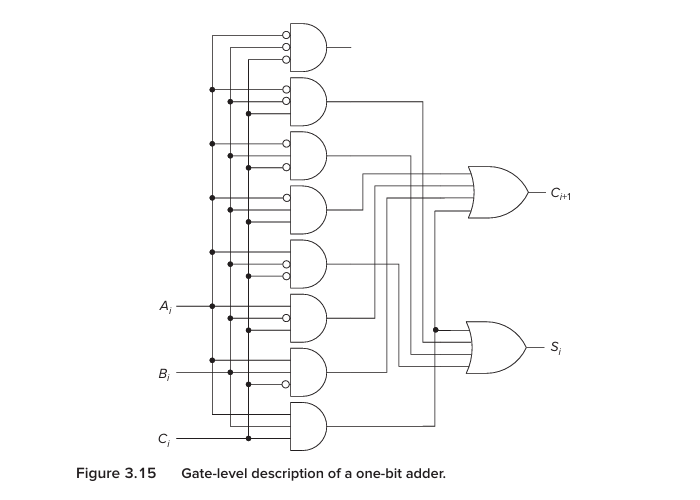
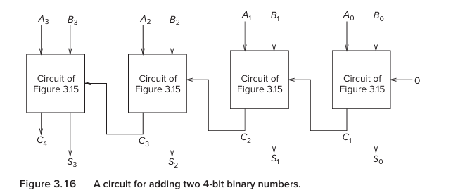

## What is Transistor?
an electrically controlled switch

the transistor has three terminals:

```
        Gate
          │
          │
       ┌─────┐
       │     │
Source │     │ Drain
       └─────┘
```

The important terminal for us is the :
Gate

because the voltage applied to the gate controls whether the path between source and drain is effectively connected.


## N-type transistor

The book introduces two types:

N-type
P-type


The simplified behavior is:

N-type:

Gate = 1
   ↓
Source-Drain path CLOSED

Gate = 0
   ↓
Source-Drain path OPEN

```
N-type

       gate
         │
         ▼
      ┌──────┐
  ────┤      ├────
      └──────┘

1 → switch ON
0 → switch OFF
```

## P-type transistor
behaves opposite

```
P-type:

Gate = 0
   ↓
Source-Drain path CLOSED

Gate = 1
   ↓
Source-Drain path OPEN
```


## Why do we have both N and P?

Because together they allow us to build extremely useful circuits where:
```
one path pulls output HIGH
another path pulls output LOW
```

And they can be arranged so that the output always gets a strong, well-defined logical value.

Circuits built using complementary P-type and N-type transistors are called CMOS circuits.

CMOS means:
Complementary Metal-Oxide Semiconductor.

```
CMOS
=
P-type + N-type
```

## Our first real logic gate : NOT
the CMOS inverter uses:

```
1 P-type transistor
+
1 N-type transistor
```

```
            Vcc
             │
       |---P-type
       |     │
 In ---|     ├──── OUT
       |     │
       |---N-type
             │
           Ground
```

Input = 0

P-type sees:
0

P-type turns ON.

N-type sees:
0

N-type turns OFF.

So:

Vcc
 │
P ON
 │
OUT

Output is connected to the high voltage.

Therefore:
```
IN  = 0
OUT = 1
9. Input = 1
```

Now:

P-type → OFF
N-type → ON

So:
```
OUT
 │
N ON
 │
Ground
```
Output is pulled low.

Therefore:
```
IN  = 1
OUT = 0
```
So:

0 → 1
1 → 0

we have physically build: NOT


## This is abstraction happening again

At first we cared about:
```
P-type transistor
N-type transistor
voltages
```

```
      ┌─────┐
IN ───┤ NOT ├─── OUT
      └─────┘
```

## NOR logic gate
```
             Vdd (+5V)
               │
             ┌─┴─┐
    Input A ─┤Q1 │ (PMOS)
             └─┬─┘
               │
             ┌─┴─┐
    Input B ─┤Q2 │ (PMOS)
             └─┬─┘
               │
               ├─────── Output Y
               │
       ┌───────┴───────┐
       │               │
     ┌─┴─┐           ┌─┴─┐
    ─┤Q3 │          ─┤Q4 │ (NMOS)
     └─┬─┘           └─┬─┘
       │               │
       └───────┬───────┘
               │
             Ground (0V)
```

```
[POWER & GROUND]
- Vdd    -> Connected to Source of Q1 (PMOS)
- Ground -> Connected to Source of Q3 (NMOS) and Source of Q4 (NMOS)

[PMOS SERIES NETWORK]
- Q1 Source -> Vdd (+5V)
- Q1 Drain  -> Q2 Source
- Q2 Drain  -> Output Y

[NMOS PARALLEL NETWORK]
- Q3 Drain  -> Output Y
- Q4 Drain  -> Output Y
- Q3 Source -> Ground (0V)
- Q4 Source -> Ground (0V)

[INPUT CONTROL]
- Input A   -> Connected to Gate of Q1 (PMOS) and Gate of Q3 (NMOS)
- Input B   -> Connected to Gate of Q2 (PMOS) and Gate of Q4 (NMOS)
```

## OR
```
NOR
+
NOT
```

```
A ──┐
    ├── NOR ── NOT ── OUT
B ──┘
```

## AND and NAND



```
A	B	AND	NAND
0	0	0	1
0	1	0	1
1	0	0	1
1	1	1	0
```

### A logical operation is not magic. It is caused by physical connectivity.


## Logical design isn't the whole story

It is possible to design a transistor arrangement that looks logically correct but produces unacceptable electrical voltage levels.

For example, directly connecting certain P-type/N-type arrangements can produce intermediate voltages such as roughly 0.7 V or 1.0 V instead of clean logical 0 and 1 levels.

This is a very important engineering lesson:

  ### A circuit must work electrically, not merely look logically correct on paper.

That's why computer engineering exists at the boundary of:
```
logic
+
electronics
```


## Combinational logic
A combinational circuit has:
  ### outputs determined only by the inputs that exist right now.

There is no memory of what happened earlier.

```
INPUT
  ↓
┌──────────────┐
│ combinational│
│    logic     │
└──────────────┘
  ↓
OUTPUT
```
No memory
No history


### Simple example

Suppose:
```
A = 1
B = 0
```

and circuit is:
```
A AND B
```

output:
```
0
```

If A changes:
```
A = 1 → 0
```

the output changes according to the new inputs.

The circuit doesn't remember:
```
“A used to be 1.”
```

That's combinational logic.


## First major combinational structure: Decoder
A decoder takes a binary pattern and identifies which pattern it is.

for example , 2 input bits:
```
AB
```

have four possibilities
```
00
01
10
11
```

A 2-to-4 decoder produces four outputs:
```
D0
D1
D2
D3
```
Exactly one is active at a time.

Like this:
```
Input 00 → D0 = 1
Input 01 → D1 = 1
Input 10 → D2 = 1
Input 11 → D3 = 1
```

The book describes the general rule:
```
n inputs → 2ⁿ outputs
```
with exactly one output asserted for each input pattern.


### why decoder is useful?
Think about address

suppose we have four memory locations:
```
Address 00 → location 0
Address 01 → location 1
Address 10 → location 2
Address 11 → location 3
```

The decoder takes:
```
10
```

and effectively says:
   Select location 2


Only that line becomes active.

That turns out to be exactly what we need when building memory.

So a decoder is essentially:

#### “Which one?”



## Decoder and CPU instructions
The LC-3 instruction contains a four-bit opcode

A 4-to-16 decoder can examine that opcode and determine which operation is being requested.

Conceptually:
```
opcode
  ↓
decoder
  ↓
"Which instruction is this?"
  ↓
activate corresponding control logic
```

So a decoder becomes part of the processor's control mechanism.


## Second major structure: MUX
Mux stands for :
# Multiplexer

Think of mux as:
   ### a digital selector

suppose you have:
```
A ─────┐
       │
       ├── MUX ─── OUT
       │
B ─────┘
```

and:
```
S = select
```

Then:
```
S = 0 → OUT = A
S = 1 → OUT = B
```

the select signal determines which input is connected to the output


## Mux mental model

Think of a railway switch:
```
Track A ──┐
          ├──── OUT
Track B ──┘
```

The selector decides which track gets connected

so:
```
Decoder
= Which one?

MUX
= Choose one.
```

## Why are MUXes important in computers?
Because a computer constantly has multiple possible sources for data.

For example:
```
Should the ALU receive:
    data from register A?

or:
    a constant?

or:
    something from another path?
```

A MUX can select the correct source.

That's why the LC-3 datapath contains multiple MUXes


### Larget muxes
A 2-to-1 mux:



```
2 inputs
1 select bit
```

A 4-to-1 mux:



```
4 inputs
2 select bits
```

Why?

Because:
```
2² = 4
```

The select bits identify one of four inputs.

An 8-to-1 mux would need:
```
2³ = 8
```

so:
```
3 select bits
```


## Building an adder
### How do we physically build the circuit that adds binary numbers

Remember:
```
  1
+ 1
---
 10
```

Each column needs to consider:
```
A bit
B bit
carry from previous column
```

So there are three inputs:
```
A
B
Cin
```

and two outputs:
```
Sum
Cout
```

The book calls this a one-bit adder, traditionally a full adder.

### 28. Let's understand the full adder intuitively

Suppose:



```
A = 0
B = 0
Carry in = 0
```

Then:
```
0 + 0 + 0 = 0
```

So:
```
Sum = 0
Carry = 0
```

Suppose:
```
0 + 1 + 0 = 1
```

Therefore:
```
Sum = 1
Carry = 0
```

Suppose:
```
1 + 1 + 0 = 2
```

Binary 2 is:
```
10
```

Therefore:
```
Sum = 0
Carry = 1
```

Suppose:
```
1 + 1 + 1 = 3
```

Binary 3:
```
11
```

Therefore:
```
Sum = 1
Carry = 1
```

### 29. Put four one-bit adders together

Suppose we want:



```
A = 1011
B = 0011
```

We need four one-bit adders:
```
bit 0 → adder
bit 1 → adder
bit 2 → adder
bit 3 → adder
```

The carry from one goes into the next:
```
             carry
              ↓
       ┌────────────┐
A0 ────►│ 1-bit     │── Sum0
B0 ────►│ adder      │
       └─────┬──────┘
             │
             ↓ carry

       ┌────────────┐
A1 ────►│ 1-bit     │── Sum1
B1 ────►│ adder      │
       └─────┬──────┘
             │
             ↓

             ...
```

The book explicitly shows a four-bit adder constructed from four one-bit adders.

And therefore:
```
16-bit adder
=
16 one-bit adders
```

#### Large complex systems can be constructed from simple components

```
transistors
   ↓
gates
   ↓
one-bit adder
   ↓
4-bit adder
   ↓
16-bit adder
   ↓
ALU
```

#### Build something big by systematically combining small understandable pieces