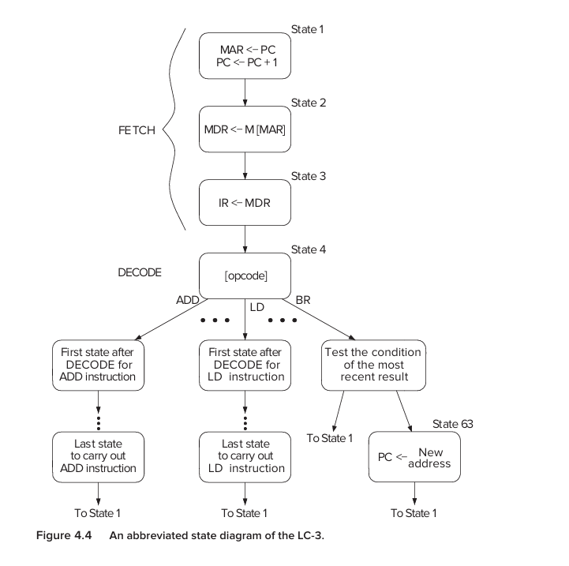

# The von Neumann Model

```
                    ┌──────────────────────┐
                    │       MEMORY         │
                    │                      │
                    │ programs + data      │
                    └──────────┬───────────┘
                               │
                               │
                    ┌──────────▼───────────┐
                    │      PROCESSOR       │
                    │                      │
                    │  ┌───────────────┐   │
                    │  │ Control Unit  │   │
                    │  └───────────────┘   │
                    │          │           │
                    │  ┌───────▼───────┐   │
                    │  │      ALU      │   │
                    │  └───────────────┘   │
                    │          │           │
                    │     Registers        │
                    └──────────┬───────────┘
                               │
                 ┌─────────────┴─────────────┐
                 ▼                           ▼
              INPUT                        OUTPUT
             keyboard                       monitor
```

The five components in the book's von Neumann model are:

```
1. Memory
2. Processing unit
3. Input
4. Output
5. Control unit
```

The key idea is that  

    the program itself is stored in memory along with data, and the control unit directs the execution of that program instruction by instruction.


## What problem is von Neumann solving?
Imagine a computer that has no stored program.

Suppose you build hardware specifically for:
```
addition
```

Then you want it to do:
```
sorting
```

You would somehow need to change its hardware.

That's inconvenient.

The von Neumann idea is:

    Keep the machine, but store the instructions that tell the machine what to do in memory.

Then:
```
same hardware
    +
different instructions in memory
    +
different behavior
```

    the program and the data are both stored as sequences of bits in memory, and the program is executed one instruction at a time under control of the control unit.

So memory might conceptually look like:
```
Address     Contents
──────────────────────────
x3000       instruction
x3001       instruction
x3002       instruction
x3003       data
x3004       data
x3005       data
```

Notice:
```
instruction
```

and:
```
data
```

are both just bit patterns in memory.

The meaning depends on how the processor uses them.

The processor's current activity and control logic determine how those bits are interpreted


## Component 1 — Memory
Memory is essentially:
```
many locations
```

and every location has:
```
address
+
stored bits
```

For the LC-3:
```
Address space = 2^16 locations
Addressability = 16 bits
```

Therefore:
```
65,536 locations
```

and:
```
each location = 16 bits
```

So each memory location contains one 16-bit word in the LC-3.


### How does the processor talk to memory?
This is where two important registers enter:
```
MAR
MDR
```

#### MAR
Memory Address Register

it contains:

    The address of the memory location we want to access.

#### MDR
Memory Data Register

it contains:

    the data being transferred to or from memory.

```
MAR = "WHERE?"

MDR = "WHAT?"
```

### Reading memory
suppose:
```
MAR = 0101
```

The processor is essentially saying:

    Memory, give me what's stored at address 0101

Memory looks at:
```
MAR
```

and finds the corresponding location.

suppose that location contains:
```
1011001010101010
```

Memory places that value into:
```
MDR
```

so:

```
             READ

Processor
   │
   │ address
   ▼
  MAR
   │
   ▼
 Memory
   │
   │ data
   ▼
  MDR
```

### Writing memory
suppose we want :
```
Address = 0101
Data = 1111000011110000
```

The processor puts:
```
MAR = 0101
MDR = 1111000011110000
```

Then activates the memory's write control.

Memory writes the MDR contents into the location specified by MAR

so:
```
MAR -> where
MDR -> what
WE -> write it
```

## Component 2 - Processing Unit
The processing unit contains the :

# ALU

Arithemetic and logic unit.

The ALU performs operations such as:
```
ADD
AND
NOT
```

For the LC-3, the ALU operates on 16-bit words.

So conceptually:
```
A ──────┐
        │
        ▼
      ┌─────┐
B ───►│ ALU │───► Result
      └─────┘
```

For example:
```
A = 5
B = 3

ALU:
ADD

Result:
8
```

### What is a word?

# Word length

A computer's word length is the size of the data elements normally processed by the ALU.

For the LC-3:
```
word length = 16 bits
```

So a word is:
```
16 bits
```

for the LC-3.

The book explains that different computers can have different word lengths, but the LC-3 is specifically a 16-bit machine.


### Registers
The ALU needs somewhere to get its inputs and somewhere to put temporary results.

That's where registers come in.

The LC-3 has:
```
R0
R1
R2
R3
R4
R5
R6
R7
```

Eight registers.

Each stores:
```
16 bits
```

The book describes these as temporary storage close to the ALU so that frequently needed values don't have to be repeatedly retrieved from slower memory.


### Why don't we just use memory for everything?
Because registers are much closer to the processor's computation machinery.

Imagine calculating:
```
(A + B) × C
```

You could:
```
read A from memory
read B from memory
ADD
write result to memory

read result from memory
read C
multiply
```

That's unnecessary movement.

Instead:
```
A → register
B → register
      ↓
     ALU
      ↓
result → register
      ↓
multiply with C
```

The book uses essentially this reasoning when explaining why processors have temporary storage in registers.


## Component 3 — Input

A computer has to get information from outside.

Examples:
```
keyboard
mouse
scanner
```

The LC-3 simplifies things and uses:
```
keyboard
```

as its input device.

The book calls these devices peripherals.


## Component 4 — Output

The computer also needs to communicate results to us.

For the LC-3:
```
monitor
```

is the basic output device.

Other examples include:
```
printer
LED
disk
```

The book lists these as examples of output device


## Component 5 -- Control unit

The ALU can:
```
ADD
AND
NOT
```

Memory can:
```
read
write
```

Registers can:

    store values

But something has to tell everyone:

    What should happen right now?

That is the :

# Control unit

### What does the control unit actually control?

Suppose we want to perform:

    R1 = R2 + R3

The control unit needs to orchestrate something like:
```
1. Get R2
2. Get R3
3. Tell ALU to ADD
4. Store result into R1
```

The ALU doesn't decide this by itself.

The control unit sends control signals telling the datapath what to do.

The LC-3's control unit contains a finite state machine, and the current instruction in the IR helps determine what actions must be performed.


### Two kinds of things moving through the processor

The LC-3 diagram distinguishes between:

#### Data

Actual values being processed.

For example:

    0000000000000101

#### Control signals

Signals telling hardware what to do.

For example, conceptually:
```
"perform ADD"
"load this register"
"put ALU result on bus"
```

The book represents these differently in Figure 4.3 and explains that filled arrowheads represent data while unfilled arrowheads represent control signals.


### Two very important control registers: PC and IR

The control unit needs to know:

    What instruction am I executing?

and:

    Where is the next instruction?

So we have:
```
IR
PC
```

### IR — Instruction Register

The:

### Instruction Register

holds:

    the instruction currently being processed.


### PC — Program Counter

The:

### Program Counter

contains:

    the address of the next instruction to be processed.


```
                    ┌──────────────┐
                    │    MEMORY    │
                    │              │
                    │ program/data │
                    └──────┬───────┘
                           │
                       MAR/MDR
                           │
                           ▼
                   ┌───────────────┐
                   │   PROCESSOR   │
                   │               │
                   │ Control Unit  │
                   │   PC / IR     │
                   │       │       │
                   │       ▼       │
                   │   control     │
                   │               │
                   │ Registers     │
                   │       │       │
                   │       ▼       │
                   │      ALU      │
                   └───────────────┘
                           │
                    ┌──────┴─────┐
                    ▼            ▼
                 Keyboard     Monitor
```


##  What exactly is an instruction?            

    The most basic unit of computer processing is the instruction.


An instruction has two main conceptual parts:
```
OPCODE
+
OPERANDS
```

### Opcode

    What operation should be performed?

For example:

    ADD

or:

    ADD

or:

    LD

or:

    BR

or:

    TRAP


### Operands

    What data or locations should the operation work with?

For:

    ADD R1, R2, R3

```
ADD
 ↑
what?

R2
 ↑
source

R3
 ↑
source

R1
 ↑
destination
```


### The three broad instruction categories

#### Operate
perform computation

example:
```
ADD
AND
```

#### Data movement
move data between places

example:
  
    LD

#### Control
change the sequence of instructions

examples:
```
BR
TRAP
```

### LC-3 instructions are 16 bits

Every LC-3 instruction occupies:

    16 bits

The top four bits:

    bits [15:12]

contain the opcode.

The remaining bits specify operands or other instruction information.

So conceptually:
```
15                    0
┌────────┬────────────────┐
│ opcode │ other fields   │
│ 4 bits │    12 bits     │
└────────┴────────────────┘
```


### Let's execute one instruction

Suppose memory contains:
```
x3000 -> ADD instruction
x3001 -> another instruction
x3002 -> another instruction
```

And:

    PC = x3000

what happens?

The processor performs an:

# Instruction Cycle

```
FETCH
DECODE
EVALUATE ADDRESS
FETCH OPERANDS
EXECUTE
STORE RESULT
```

Do not confuse this with a single clock cycle

### Instruction cycle vs clock cycle

This deserves special attention.

#### Clock cycle

One basic timing interval.

    tick

#### Instruction cycle

The entire sequence of work needed to process one instruction.

It may require several clock cycles.

### Phase 1 — FETCH

The processor needs to get the next instruction from memory.

Remember:

    PC = address of next instruction

So:

#### Step 1

Copy:

    PC → MAR

and increment PC:

    PC → PC + 1

The book says these happen simultaneously in the first FETCH machine cycle.


#### Step 2 of FETCH

Memory is accessed using:

    MAR

Suppose:

    M[x3000] = 0001000001000011

Memory places that value into:

    MDR

So:
```
MAR = x3000

Memory:
x3000 → 0001000001000011

          ↓

MDR = 0001000001000011
```

### Step 3 of FETCH

Now:

    MDR → IR

So:
```
IR = 0001000001000011
```

Now the processor has the instruction.

Fetch is complete.


## Phase 2 — DECODE
Now the processor asks:

    “What instruction did I just fetch?”

Look at:

    IR

Suppose:

    IR = 0001...

The top four bits:

    0001

are the opcode for:

    ADD

The LC-3 uses a decoder to identify which opcode is represented.


## Phase 3 — EVALUATE ADDRESS
Some instructions need memory addresses.

For example:

    LD

means:

    Load a value from memory.

So the processor has to determine:

    “Which memory address should I read?”

The LC-3's LD uses:
```
PC + offset
```

The book explains that the offset is sign-extended to 16 bits and added to the current PC.


Example

Suppose:
```
PC = x3001
offset = +6
```

Then:
```
address = x3001 + 6
        = x3007
```

So:
```
LD R1, ...
```

will eventually read:
```
M[x3007]
```

and put it in:
```
R1
```

### Does every instruction need EVALUATE ADDRESS?

No.

For:
```
ADD
```

the operands are already in:
```
registers
```

or possibly encoded directly in the instruction as an immediate value.

So ADD doesn't need to calculate a memory address.


## Phase 4 — FETCH OPERANDS

Now the processor obtains the actual values the instruction needs.

For:
```
ADD R6, R2, R6
```

it needs:
```
contents of R2
contents of R6
```

For:
```
LD R2, ...
```

it needs:
```
the value stored in the calculated memory address
```

## Phase 5 — EXECUTE

Now we actually perform the requested operation.

For:
```
ADD
```

the ALU adds.

For:
```
AND
```

the ALU performs bitwise AND.

For:
```
BR
```

the processor may calculate a new PC.


## Phase 6 — STORE RESULT

Finally, the result goes where the instruction says it should go.

For example:
```
ADD R1, R2, R3
```

might conceptually mean:
```
R1 ← R2 + R3
```

So:
```
ALU result
   ↓
R1
```

    The six phases are a conceptual framework. A particular instruction may skip some phases.


## Example: Let's execute ADD completely

suppose:
```
R2 = 5
R6 = 3
```

and memory contains:
```
M[x3000] = ADD R6, R2, R6
```

initially:
```
PC = x3000
```

### Fetch

```
MAR <- x3000
PC <- x3001
MDR <- M[x3000]
IR <- MDR
```

Now:

```
IR = ADD R6,R2,R6
```

### Decode
Hardware sees:

```
opcode = ADD
```

###  Evaluate address
Not needed.

### Fetch operands
```
R2 = 5
R6 = 3
```

### Execute
ALU:

```
5 + 3 = 8
```

### Store result

```
R6 <- 8
```

Done.

Then:
```
PC = x3001
```

so the next instruction is fetched from:
```
M[x3001]
```

## But how does a loop happen?

Normally: sequential execution.

```
instruction 1
↓
instruction 2
↓
instruction 3
↓
instruction 4
```

But programs need:

```
if
while
for
function calls
loops
```

So sometimes we need:

```
instruction 1
instruction 2
instruction 3
instruction 2
instruction 3
instruction 2
...
```

How?

# Change the PC.

The book explains that control instructions change the PC during execution so that the next FETCH retrieves a different instruction than the normal sequential one.

This is one of the most important things to understand about control flow at machine level.


### How does a branch create a loop?
Suppose:

```
x3003 -> instruction
x3004 -> instruction
x3005 -> BR
```

if BR decides:

    Go back to x3003

it changes:
```
PC
```

from its normal sequential value:
```
x3006
```

to:
```
x3003
```

Then the next instruction FETCH uses:
```
PC = x3003
```

and the processor executes the earlier instructions again.

That's literally how looping works at this level


### BR — Branch instruction

The LC-3 branch instruction contains:
```
opcode
+
condition
+
offset
```

The book explains that the condition determines whether the branch happens, and the offset is sign-extended and added to the PC to form the target address.

Think:
```
BR condition, offset
```

as:

    “If the specified condition is true, change the PC by this offset. Otherwise, leave the PC alone.”


Example

Suppose:
```
PC after FETCH = x3006
offset = -6
```

Then:
```
x3006 + (-6) = x3000
```

So:
```
PC ← x3000
```

Now the next FETCH starts again at:
```
x3000
```

That's a loop.

```
ADD
 ↓
result

BR
 ↓
ask something about result

true  → change PC
false → continue normally
```

```
while (x != 0) {
    x--;
}
```

At a high level:
```
while condition
    ↓
repeat body
```

At the machine level, conceptually:
```
do body

test x

if x != 0
    change PC back to body

otherwise
    continue forward
```

## The Control Unit is itself an FSM

The LC-3 control unit contains a synchronous finite state machine. Each state represents a unit of processor activity, and the FSM moves from one state to another each clock cycle.

```
              CONTROL UNIT

        ┌────────────────────┐
        │      FSM           │
        │                    │
        │ State 1 → State 2  │
        │    ↓          ↓    │
        │ State 3 → State 4  │
        └────────────────────┘
```

Each state says:

    During this clock cycle, perform these control actions.


### Example: FETCH as FSM states

#### State 1
```
MAR ← PC
PC ← PC + 1
```

#### State 2
```
MDR ← Memory[MAR]
```

#### State 3
```
IR ← MDR
```

#### State 4
Decode.




# CPU:

```
ALU
+
registers
+
memory
+
control FSM
```

### Example of control signals

Suppose the FSM wants:
```
MAR ← PC
```

How can it physically make that happen?

The control unit activates signals such as:
```
GatePC
LD.MAR
```

The book explains that GatePC allows the PC value onto the processor bus and LD.MAR tells the MAR register to capture the bus value at the end of the clock cycle.

So the control unit is effectively saying:
```
PC:
"put your value on the bus."

MAR:
"capture the bus value."
```

This is orchestration.


### Processor bus

    a shared pathway used to move values between processor components

Conceptually:
```
Register
    │
    ▼
  BUS
    │
    ├────► another register
    │
    ├────► MAR
    │
    └────► ALU input
```

The control unit decides which component is allowed to put data onto the bus and which component is allowed to receive it.

That's what many of the control signals are doing.


## The LD instruction

Let's make memory access concrete.

Suppose:
```
R2 = ?
```

and we want:
```
R2 ← M[x3007]
```

The LC-3 has:
```
LD
```

The book describes LD as:

    go to a particular memory location, read the value, and put it into a register.

Conceptually:
```
PC
 ↓
calculate address
 ↓
MAR
 ↓
memory
 ↓
MDR
 ↓
R2
```

More specifically:
```
address = PC + sign_extended(offset)
```

Then:
```
M[ address ] → R2
```


### Why sign-extend?

Suppose the 9-bit offset is:
```
111111001
```

From Chapter 2 we know this is a negative 2's complement number:
```
-7
```

The processor needs to use it as a 16-bit number.

So:
```
111111001
```

becomes:
```
1111111111111001
```

That's sign extension.

Then:
```
PC + (-7)
```

gives the target address.


## TRAP

Suppose a user program wants to:
```
print something
```

or:
```
read a key
```

or:
```
halt
```

The LC-3 uses:

# TRAP

to request certain services from the operating system.

The book describes TRAP as a control instruction/system call and says that the eight-bit trap vector identifies the requested servi


### What is an operating system in this model?

The operating system is itself a program.

The book explicitly says that systems such as Linux, DOS, MacOS, and Windows are computer programs, and from the computer's perspective the instruction cycle continues while executing the OS as well as user programs.

That's a powerful concept.

There isn't a magical separate "OS mode of existence."

At the machine level:
```
instructions
```

are being executed.

Some belong to:
```
user program
```

and others belong to:
```
operating system
```

### How does the machine halt?

This is an interesting philosophical problem.

We said:
```
FETCH
DECODE
EXECUTE
FETCH
DECODE
EXECUTE
...
forever
```

So how does it stop?

The LC-3 uses the operating system mechanism.

The book explains that the clock keeps driving the instruction cycle, and stopping execution requires stopping the clock's effective output by clearing the RUN latch. In the LC-3, the OS handles this through the HALT service requested by TRAP x25.

```
program
   ↓
TRAP x25
   ↓
operating system
   ↓
clear RUN
   ↓
clock output stops
   ↓
instruction processing stops
```

## Now the best example: multiplication

Suppose the computer doesn't have:
```
MUL
```

instruction.

But it has:
```
ADD
```

Can it multiply?

Yes.

Because:
```
5 × 4
=
5 + 5 + 5 + 5
```

### The algorithm

We want:
```
5 × 4
```

Algorithm:
```
result = 0

repeat 4 times:
    result = result + 5

return result
```

Or:
```
R1 = 5
R2 = 4
R3 = 0

while R2 != 0:
    R3 = R3 + R1
    R2 = R2 - 1
```

```
LD
→ load data

AND
→ initialize a register to zero

ADD
→ arithmetic

BR
→ loop

TRAP
→ halt through OS
```

```
x3000 → LD R1, ...
x3001 → LD R2, ...
x3002 → initialize R3
x3003 → R3 = R3 + R1
x3004 → R2 = R2 - 1
x3005 → branch if not zero
x3006 → HALT
x3007 → 5
x3008 → 4
```

### first instruction
```
x3000:
LD R1, x3007
```

The processor:
```
FETCH
↓
DECODE
↓
calculate address
↓
read M[x3007]
↓
put value into R1
```

So:
```
R1 = 5
```

### Second instruction
```
x3001:
LD R2, x3008
```

Eventually:
```
R2 = 4
```

Now:
```
R1 = 5
R2 = 4
```

### Third instruction

We need:
```
R3 = 0
```

The program uses an AND trick.

Conceptually:
```
R3 AND 0
```

always produces:
```
0
```

so:
```
R3 = 0
```

The book explicitly explains this initialization technique

Now:
```
R1 = 5
R2 = 4
R3 = 0
```

### Fourth instruction
```
R3 = R3 + R1
```

First time:
```
R3 = 0 + 5
   = 5
```

### Fifth instruction
```
R2 = R2 - 1
```

Remember, the LC-3 doesn't have a subtraction instruction in this simple set.

So it uses:
```
ADD R2, R2, #-1
```

Conceptually:
```
R2 = 4 - 1
   = 3
```

### Sixth instruction — branch

Now:
```
R2 = 3
```

Is it zero?
```
NO
```

So:
```
BR not-zero
```

changes the PC back to:
```
x3003
```

Now the loop begins again.

### Second iteration
```
R3 = 5 + 5 = 10
R2 = 3 - 1 = 2
```

Branch back.

### Third iteration
```
R3 = 10 + 5 = 15
R2 = 2 - 1 = 1
```

Branch back.

### Fourth iteration
```
R3 = 15 + 5 = 20
R2 = 1 - 1 = 0
```

Now:
```
R2 == 0
```

The branch condition fails.

So the PC is not changed backward.

The processor proceeds to:
```
x3006
```

### HALT

At:
```
x3006
```

the program executes:
```
TRAP x25
```

which asks the operating system to halt the program/computer processing in the LC-3 model.

Final:
```
R3 = 20
```

```
                   MEMORY
                     │
                     │ instruction
                     ▼
                    MDR
                     │
                     ▼
                     IR
                     │
                     │ opcode
                     ▼
                ┌───────────┐
                │  CONTROL  │
                │    FSM    │
                └─────┬─────┘
                      │
              control signals
                      │
       ┌──────────────┼───────────────┐
       ▼              ▼               ▼
   Registers         ALU            Memory
       │              │               │
       └───────┬──────┘               │
               ▼                      │
             RESULT                   │
               │                      │
               ▼                      │
           Register /                 │
           Memory                    │
                                      │
PC ─────► MAR ─────► Memory ◄────────┘
```