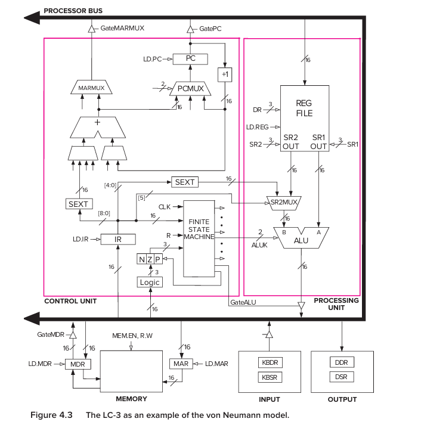

# The von Neumann Model

```
                    ┌──────────────────────┐
                    │       MEMORY         │
                    │                      │
                    │ programs + data      │
                    └──────────┬───────────┘
                               │
                               │
                    ┌──────────▼───────────┐
                    │      PROCESSOR       │
                    │                      │
                    │  ┌───────────────┐   │
                    │  │ Control Unit  │   │
                    │  └───────────────┘   │
                    │          │           │
                    │  ┌───────▼───────┐   │
                    │  │      ALU      │   │
                    │  └───────────────┘   │
                    │          │           │
                    │     Registers        │
                    └──────────┬───────────┘
                               │
                 ┌─────────────┴─────────────┐
                 ▼                           ▼
              INPUT                        OUTPUT
             keyboard                       monitor
```

The five components in the book's von Neumann model are:

```
1. Memory
2. Processing unit
3. Input
4. Output
5. Control unit
```

The key idea is that  

    the program itself is stored in memory along with data, and the control unit directs the execution of that program instruction by instruction.


## What problem is von Neumann solving?
Imagine a computer that has no stored program.

Suppose you build hardware specifically for:
```
addition
```

Then you want it to do:
```
sorting
```

You would somehow need to change its hardware.

That's inconvenient.

The von Neumann idea is:

    Keep the machine, but store the instructions that tell the machine what to do in memory.

Then:
```
same hardware
    +
different instructions in memory
    +
different behavior
```

    the program and the data are both stored as sequences of bits in memory, and the program is executed one instruction at a time under control of the control unit.

So memory might conceptually look like:
```
Address     Contents
──────────────────────────
x3000       instruction
x3001       instruction
x3002       instruction
x3003       data
x3004       data
x3005       data
```

Notice:
```
instruction
```

and:
```
data
```

are both just bit patterns in memory.

The meaning depends on how the processor uses them.

The processor's current activity and control logic determine how those bits are interpreted


## Component 1 — Memory
Memory is essentially:
```
many locations
```

and every location has:
```
address
+
stored bits
```

For the LC-3:
```
Address space = 2^16 locations
Addressability = 16 bits
```

Therefore:
```
65,536 locations
```

and:
```
each location = 16 bits
```

So each memory location contains one 16-bit word in the LC-3.


### How does the processor talk to memory?
This is where two important registers enter:
```
MAR
MDR
```

#### MAR
Memory Address Register

it contains:

    The address of the memory location we want to access.

#### MDR
Memory Data Register

it contains:

    the data being transferred to or from memory.

```
MAR = "WHERE?"

MDR = "WHAT?"
```

### Reading memory
suppose:
```
MAR = 0101
```

The processor is essentially saying:

    Memory, give me what's stored at address 0101

Memory looks at:
```
MAR
```

and finds the corresponding location.

suppose that location contains:
```
1011001010101010
```

Memory places that value into:
```
MDR
```

so:

```
             READ

Processor
   │
   │ address
   ▼
  MAR
   │
   ▼
 Memory
   │
   │ data
   ▼
  MDR
```

### Writing memory
suppose we want :
```
Address = 0101
Data = 1111000011110000
```

The processor puts:
```
MAR = 0101
MDR = 1111000011110000
```

Then activates the memory's write control.

Memory writes the MDR contents into the location specified by MAR

so:
```
MAR -> where
MDR -> what
WE -> write it
```

## Component 2 - Processing Unit
The processing unit contains the :

# ALU

Arithemetic and logic unit.

The ALU performs operations such as:
```
ADD
AND
NOT
```

For the LC-3, the ALU operates on 16-bit words.

So conceptually:
```
A ──────┐
        │
        ▼
      ┌─────┐
B ───►│ ALU │───► Result
      └─────┘
```

For example:
```
A = 5
B = 3

ALU:
ADD

Result:
8
```

### What is a word?

# Word length

A computer's word length is the size of the data elements normally processed by the ALU.

For the LC-3:
```
word length = 16 bits
```

So a word is:
```
16 bits
```

for the LC-3.

The book explains that different computers can have different word lengths, but the LC-3 is specifically a 16-bit machine.


### Registers
The ALU needs somewhere to get its inputs and somewhere to put temporary results.

That's where registers come in.

The LC-3 has:
```
R0
R1
R2
R3
R4
R5
R6
R7
```

Eight registers.

Each stores:
```
16 bits
```

The book describes these as temporary storage close to the ALU so that frequently needed values don't have to be repeatedly retrieved from slower memory.


### Why don't we just use memory for everything?
Because registers are much closer to the processor's computation machinery.

Imagine calculating:
```
(A + B) × C
```

You could:
```
read A from memory
read B from memory
ADD
write result to memory

read result from memory
read C
multiply
```

That's unnecessary movement.

Instead:
```
A → register
B → register
      ↓
     ALU
      ↓
result → register
      ↓
multiply with C
```

The book uses essentially this reasoning when explaining why processors have temporary storage in registers.


## Component 3 — Input

A computer has to get information from outside.

Examples:
```
keyboard
mouse
scanner
```

The LC-3 simplifies things and uses:
```
keyboard
```

as its input device.

The book calls these devices peripherals.


## Component 4 — Output

The computer also needs to communicate results to us.

For the LC-3:
```
monitor
```

is the basic output device.

Other examples include:
```
printer
LED
disk
```

The book lists these as examples of output device


## Component 5 -- Control unit

The ALU can:
```
ADD
AND
NOT
```

Memory can:
```
read
write
```

Registers can:

    store values

But something has to tell everyone:

    What should happen right now?

That is the :

# Control unit

### What does the control unit actually control?

Suppose we want to perform:

    R1 = R2 + R3

The control unit needs to orchestrate something like:
```
1. Get R2
2. Get R3
3. Tell ALU to ADD
4. Store result into R1
```

The ALU doesn't decide this by itself.

The control unit sends control signals telling the datapath what to do.

The LC-3's control unit contains a finite state machine, and the current instruction in the IR helps determine what actions must be performed.


### Two kinds of things moving through the processor

The LC-3 diagram distinguishes between:

#### Data

Actual values being processed.

For example:

    0000000000000101

#### Control signals

Signals telling hardware what to do.

For example, conceptually:
```
"perform ADD"
"load this register"
"put ALU result on bus"
```

The book represents these differently in Figure 4.3 and explains that filled arrowheads represent data while unfilled arrowheads represent control signals.




### Two very important control registers: PC and IR

The control unit needs to know:

    What instruction am I executing?

and:

    Where is the next instruction?

So we have:
```
IR
PC
```

### IR — Instruction Register

The:

### Instruction Register

holds:

    the instruction currently being processed.


### PC — Program Counter

The:

### Program Counter

contains:

    the address of the next instruction to be processed.


```
                    ┌──────────────┐
                    │    MEMORY    │
                    │              │
                    │ program/data │
                    └──────┬───────┘
                           │
                       MAR/MDR
                           │
                           ▼
                   ┌───────────────┐
                   │   PROCESSOR   │
                   │               │
                   │ Control Unit  │
                   │   PC / IR     │
                   │       │       │
                   │       ▼       │
                   │   control     │
                   │               │
                   │ Registers     │
                   │       │       │
                   │       ▼       │
                   │      ALU      │
                   └───────────────┘
                           │
                    ┌──────┴─────┐
                    ▼            ▼
                 Keyboard     Monitor
```


##  What exactly is an instruction?            

    The most basic unit of computer processing is the instruction.


An instruction has two main conceptual parts:
```
OPCODE
+
OPERANDS
```

### Opcode

    What operation should be performed?

For example:

    ADD

or:

    ADD

or:

    LD

or:

    BR

or:

    TRAP


### Operands

    What data or locations should the operation work with?

For:

    ADD R1, R2, R3

```
ADD
 ↑
what?

R2
 ↑
source

R3
 ↑
source

R1
 ↑
destination
```


### The three broad instruction categories

#### Operate
perform computation

example:
```
ADD
AND
```

#### Data movement
move data between places

example:
  
    LD

#### Control
change the sequence of instructions

examples:
```
BR
TRAP
```

### LC-3 instructions are 16 bits

Every LC-3 instruction occupies:

    16 bits

The top four bits:

    bits [15:12]

contain the opcode.

The remaining bits specify operands or other instruction information.

So conceptually:
```
15                    0
┌────────┬────────────────┐
│ opcode │ other fields   │
│ 4 bits │    12 bits     │
└────────┴────────────────┘
```