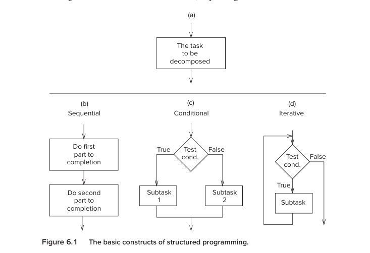
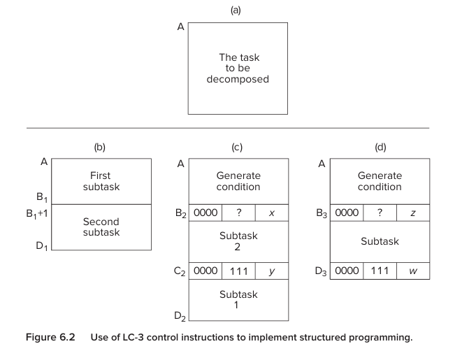
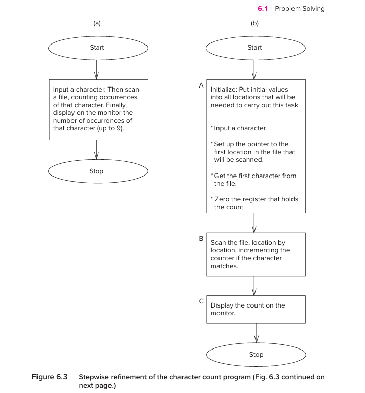

This chapter teaches us:

    How do i take a problem, turn it into a program, and then systematically find what i got wrong?

The book calls this systematic decomposition, also called stepwise refinement, and then applies the same disciplined thinking to debugging.

# Programming
The chapter has two major parts:
```
6.1 Problem Solving
    ↓
    How to construct a program

6.2 Debugging
    ↓
    How to find and fix mistakes
```

the most important idea of the entire chapter is:
```
Problem
   ↓
Understand the problem
   ↓
Algorithm
   ↓
Break algorithm into smaller tasks
   ↓
Break those tasks into even smaller tasks
   ↓
Simple operations
   ↓
LC-3 instructions
```

And when the program is wrong:
```
Program
   ↓
Observe actual behavior
   ↓
Compare with expected behavior
   ↓
Locate the mismatch
   ↓
Identify the instruction causing it
   ↓
Fix it
   ↓
Test again
```


## First understand what an algorithm actually is
Suppose i tell you:

    Make tea.

That is problem statement.

But a computer cannot directly execute make tea.

We need to turn it into precise steps:
```
1. Get water.
2. Heat water.
3. Put tea leaves in container.
4. Pour hot water.
5. Wait.
6. Add milk.
7. Add sugar.
```
This is moving from a problem statement to an algorithm.

this book describes an algorithm as a step-by-step procedure having threee important properties:

#### Definiteness
Every step must be precise.

Bad:
```
Do the calculation.
```

Good:
```
Add the value in R1 to the value in R2.
```

#### Effective computability
Every step must actually be something the computer can perform.

for example:
```
understand what the user wants.
```

is not directly a machine operation.

But:
```
Read a charecter.
Compare it with 'A'.
```

can be implemented.

#### Finiteness
the algorithm must actually terminate

For example:
```
1. Read number.
2. Add 1.
3. Repeat forever.
```

is a procedure, but it doesn't terminate.

## Systematic decomposition
Imagine you are given this problem:

    Count how many times a particular character occurs in a file.

At first glance, that's one big problem.

But trying to immediately write machine instructions for it is difficult.

So we decompose it.

The book calls this:

    Systematic decomposition

and

    Stepwise refinement

The basic idea is extremely simple:
```
Big problem
    ↓
smaller problems
    ↓
even smaller problems
    ↓
simple operations
    ↓
instructions
```

### Why decomposition is so powerful
Suppose someone gives you:

    Build a complete web browser.

That sounds overwhelming.

But you can break it into:
```
Browser
├── UI
├── Networking
├── HTML parsing
├── CSS parsing
├── JavaScript engine
├── Storage
└── Rendering
```

Then:
```
Networking
├── DNS
├── TCP
├── HTTP
└── TLS
```

Then:
```
HTTP
├── construct request
├── send request
├── receive response
└── parse response
```
Each step becomes manageable.


### The three basic constructs
the book says there are three fundamental ways to decompose a task:
```
1. Sequential
2. Conditional
3. Iterative
```

## Sequential construct
Sequential means:

    Do A, then do B.

Example:
```
A
↓
B
```

For example:
```
1. Read a number.
2. Add 5.
```

Nothing complicated.

In LC-3:
```
instruction 1
instruction 2
instruction 3
instruction 4
...
```

The PC naturally moves from one instruction to the next.

So this is important:

    Sequential execution usually requires no branch instruction.

The PC simply increments.


## Conditional construct
Conditional means:

    Do one thing OR another depending on a condition.

Think:

        condition?
        /       \
      yes       no
       ↓         ↓
      A          B
       \         /
        \       /
         continue

Example:
```
if number == 0
    do A
else
    do B
```

Only one side executes.

### How LC-3 implements a condition
Remember the condition codes:
```
N = negative
Z = zero
P = positive
```

A previous instruction produces some result.

That result sets the condition codes.

Then:
```
BR
```

checks them.

For example:
```
ADD R1, R2, #-5
BRz SOMEWHERE
```

Conceptually:
```
R1 = R2 - 5
     ↓
set N/Z/P
     ↓
BRz
     ↓
if result == 0
    jump
else
    continue normally
```

So the branch is essentially:

    “Based on the result I just calculated, should I change the PC?”


## Iterative construct
Iteration means:

    Repeat something while a condition remains true.

Example:
```
while there are more numbers
    process next number
```

Mental picture:
```
       test
      /    \
   false   true
    ↓        ↓
   done    body
             |
             |
             └──────→ test
```

So unlike a conditional:
```
conditional:
condition → choose once
```

iteration:
```
condition → choose
              ↓
             body
              ↓
          test again
```

### Every construct has one entrance and one exit
The book's diagrams show that each construct has:
```
one entrance
     ↓
 construct
     ↓
one exit
```

that gives us a predictable structure

Think about:
```
main task
   ↓
initialize
   ↓
process
   ↓
output
   ↓
done
```

instead of arbitrary jumps everywhere

this is one reason structured programming makes programs easier to understand and debug.

### How these constructs translate into LC-3

#### Sequential
Mostly:
```
PC ← PC + 1
```
No special control instruction is needed.

#### Conditional
Usually:
```
compute condition
      ↓
set N/Z/P
      ↓
BR
```

#### Iterative
Usually:
```
compute condition
      ↓
BR
      ↓
body
      ↓
BR back to test
```






## Charecter counting

### Step-1 - understand what is required
we need:
```
input charecter
scan file
count matching charecters
display count
```

Already we can see three major tasks:
```
A = initialization
B = scan/process file
C = display result
```

This is our first decomposition.



### Decompose initialization

What does initialization mean?

We ask:

    What information must exist before the main algorithm can start?

We need:
```
1. Input character
2. Pointer to first file character
3. Current file character
4. Count = 0
```

So:
```
A
├── A1: count = 0
├── A2: input character
├── A3: pointer = first file location
└── A4: load first character
```

Notice what happened.

We took:
```
Initialize
```

and turned it into several concrete jobs.

This is stepwise refinement


### Decompose the scanning operation
We have:
```
B = scan file and count matches
```
That's still too vague.

We refine it:
```
while there are more characters
    test current character
    increment count if it matches
    get next character
```
Now we have an iterative construct.

The book uses the sentinel method, because we don't know beforehand how many characters the file contains.

The sentinel is the end-of-text character, EOT.

So:
```
while current character != EOT
    ...
```

### Decompose one loop iteration
We now have:
```
B1 = process current character
```

Still too vague.

Break it down:
```
B1
├── B2: test current character
├── if match → increment counter
└── B3: get next character
```

Then break B2 down:
```
B2:
    Is current character == input character?
```

And B3:
```
B3:
    increment pointer
    load next character
```

Now the task is approaching machine-level operations.


### Decompose output
Originally:
```
C = display count
```

Still somewhat vague.

Break it into:
```
C1 = convert count into ASCII
C2 = output character
```

Because the monitor expects the ASCII representation of the digit.

So:
```
C
├── convert
└── display
```

Again:
```
big task
 ↓
smaller task
 ↓
smaller task
 ↓
simple task
```

### And only now do we write LC-3 instructions
Do not start with:

    “Which LC-3 instruction should I use?”

Start with:

    “What is the algorithm?”

Then:

    “What smaller tasks make up the algorithm?”

Then:

    “Which LC-3 instructions implement those tasks?”

The book explicitly says that the final stage of the decomposition can then be translated into LC-3 code

```
Character Count
│
├── A. Initialize
│   ├── count = 0
│   ├── read input character
│   ├── set file pointer
│   └── load first character
│
├── B. Process file
│   │
│   └── while not EOT
│       │
│       ├── compare current char
│       ├── if match
│       │      └── count++
│       │
│       └── get next character
│
└── C. Display
    ├── convert count to ASCII
    └── output
```

### A very important programming habit
Sometimes you cannot understand the entire problem immediately.

That's normal.

Instead:
```
understand one piece
      ↓
build on it
      ↓
understand another piece
      ↓
connect them
```

The book explicitly encourages this rather than expecting complete understanding from the beginning.

This is actually a very useful professional programming habit.


## debugging
Now we move from:

    How to build the program

to:

    How to figure out why it doesn't work.

The book makes an important observation:

    Writing the program isn't necessarily the hardest part.

A program can look perfectly reasonable and still be wrong.

So debugging becomes systematic too.

### First build a proper mental model of debugging
Suppose you expect:
```
Input: 10
Input: 20
Result: 30
```

But the program produces:
```
40
```

Don't immediately start randomly changing instructions

instead ask:
```
What should happen?
        ↓
What actually happened?
        ↓
Where did they first become different?
```

That's debugging

The book compares debugging to taking a wrong turn while driving: return to a known point, compare where you are with where you should be, and proceed systematically.


### Trace — one of the most important debugging concepts
A trace records:
```
which instructions executed
+
what results they produced
```

For LC-3, you might track:
```
PC
R1
R2
R3
...
```

after each instruction or at selected points.

Example:
```
PC      R2     R5

x3201   0      3
x3202   10     3
x3203   10     2
x3201   20     2
x3202   20     2
...
```

Now the program's execution is no longer mysterious.

You're watching its state change over time.

The book specifically defines tracing as keeping track of the sequence of executed instructions and the results produced by them

### Why tracing works
Imagine you expect:
```
R5:
3 → 2 → 1 → 0
```

but the trace says:
```
R5:
3 → 2 → 1 → 0 → -1
```

Now something is obviously wrong.

You don't need to inspect the whole program.

You know:

    The error is somewhere around the point where R5 became -1.

That is the essence of debugging:
```
Entire program
       ↓
large search space

Trace
       ↓
smaller search space

Breakpoint
       ↓
even smaller

single-step
       ↓
specific instruction
```

### Modules make debugging easier
The book recommends partitioning a program into modules and examining results at the end of each module.

Suppose:
```
Program
├── Input module
├── Calculation module
└── Output module
```

And output is wrong.

You can check:
```
Input result       ✓
Calculation result ✗
Output result      ✗
```

Then you immediately know:

    The bug is probably in the calculation module.

You don't need to inspect the input module anymore.

This is why good program structure helps debugging.


## LC-3 debugging operations
The chapter introduces four basic things you need to be able to do with the simulator
```
1. Set values
2. Execute instructions
3. Stop execution
4. Display state
```

### Set values
Suppose module A is responsible for a keyboard input.

And module B processes the resulting character.

you haven't finished debugging A.

Do you have to wait?

No.

you can directly put a value into the register that A would have produced

For example:
```
R0 = ASCII 'A'
```
Then start testing module B.

The book explicitely gives this idea as a reason to manually place expected values into registers/memory before testing a later module.

this is conceptaully very important:

    You can test one part of a program independently by supplying its expected inputs manually.

that idea continues into modern unit testing.

### Run
Run means:
```
execute until:
    HALT
or
    breakpoints
```

So:
```
Run
 ↓
program executes
 ↓
breakpoint encountered
 ↓
stop
```

or:
```
Run
 ↓
...
 ↓
HALT
```

### Step
Step means:

    Execute a chosen number of instructions and stop.

If you choose:
```
1
```

you execute exactly one instruction.

That's called:

    single-stepping

This lets you observe how each instruction changes the machine state.

### Breakpoint
Breakpoint means:

    “Run normally, but stop when you reach this specific address.”

For example:
```
breakpoint = x3203
```

Then:
```
Run
 ↓
x3200
x3201
x3202
 ↓
x3203
STOP
```

The simulator checks the PC during instruction fetch and stops when the PC reaches the breakpoint address.

This is much better than single-stepping through 10,000 instructions.

### Display Values
Once execution stops, inspect:
```
R0
R1
R2
...
memory[x4000]
memory[x4001]
...
```

The purpose is simple:

    Observe the state of the machine at a useful moment.