## Understand what an array really is

### Why do we need arrays?
Imagine you want to store the marks of five students.

you could write:
```
int mark1 = 75;
int mark2 = 82;
int mark3 = 91;
int mark4 = 68;
int mark5 = 88;
```

This works, but suppose you have 100 students. you would need 100 separate variable names, and writing a loop to process those values would be awkward.

Instead, C lets you create an array:
```
int marks[5] = {75, 82, 91, 68, 88};
```

Read this declaration carefully:
- int means each element stores an integer.
- marks is the array's name.
- [5] means the array contains five elements.
- {75,82,91,68,88} supplies the initial values.

conceptually, we have created five integer elements grouped into one array.

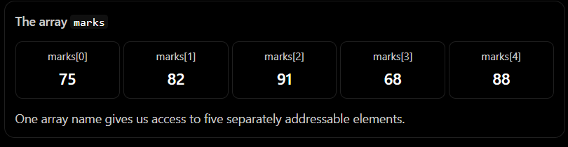

The key benefit is that we can use a number called an index to select an element.

```
printf("%d\n", marks[0]);   // 75
printf("%d\n", marks[2]);   // 91
printf("%d\n", marks[4]);   // 88
```

### Why does indexing start at zero?
For an array containing five elements, the valid indices are:

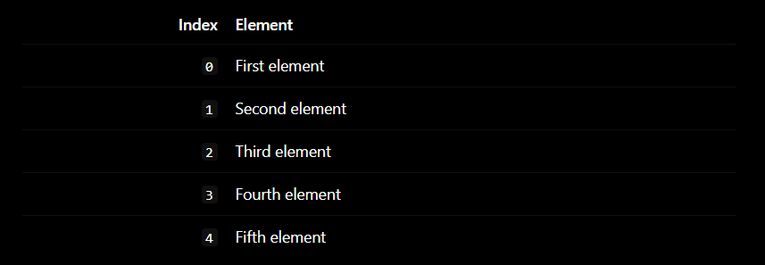

The last index is not 5. it is 4.

the general rule is:

    last valid index = array length - 1

for an array of length n, valid indices are from 0 through n - 1.

Why zero? Because indexing can be understood as an offset from the beginning of an array.

- marks[0]: move zero elements from the beginning.
- marks[1]: move one element from the beginning.
- marks[2]: move two elements from the beginning.


### What happens in memory?
Suppose, just for illustration, that marks begins at memory address 1000, and each int occupies four bytes on this particular machine.

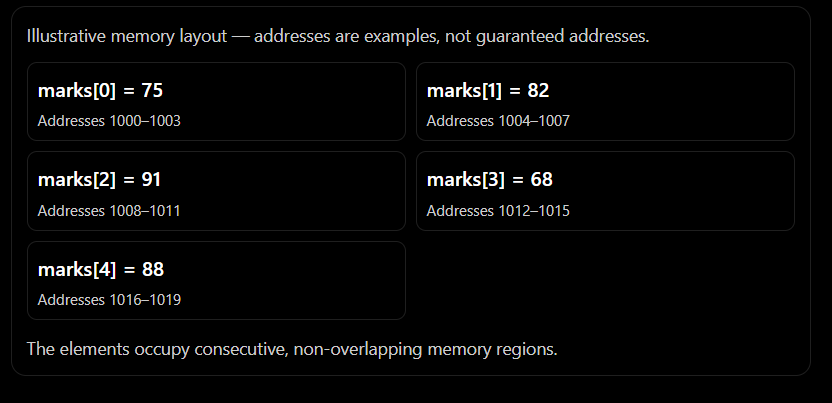

Three important observations:

1. The elements are stored in contiguous memory: one immediately follows another.
2. Each element occupies sizeof(int) bytes.
3. The address of an element can be calculated from the starting address and its index.

For an array of integers, the conceptual address calculation is:

    address of element i = base address + i * sizeof(int)

for example, if the base address is 1000 and sizeof(int) is 4, the address of marks[3] is:

    1000 + 3 * 4 = 1012

this calculation is the bridge between arrays and pointers.

One precision point: C guarantees that array elements are contiguous and that sizeof(marks) gives the total size of this complete array object. But C does not guarantee that an int is four bytes or that the array begins at any particular address. Those details depend on the implementation and the actual program execution.


### accessing and modifying elements
```
int marks[5] = {75, 82, 91, 68, 88};

marks[2] = 95;
marks[0] = 70;
```

After these assignments, the values are:
```
70, 82, 95, 68, 88
```

The array has the same number of elements. We have changed the values stored in two of those elements.

```
#include <stdio.h>

int main(void)
{
    int marks[5] = {75, 82, 91, 68, 88};

    for (int i = 0; i < 5; i++) {
        printf("%d\n", marks[i]);
    }

    return 0;
}
```

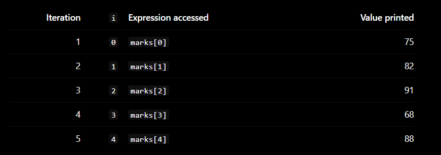

when i becomes 5, the condition i < 5 is false, so the loop stops.

Notice how the array and loop complement each other: the array gives the elements a predictable organization, while the loop systematically visits each index.


### A serious mistake: accessing beyond the array
Consider this:
```
int marks[5] = {75, 82, 91, 68, 88};

printf("%d\n", marks[5]);  // Wrong
```

Why is this wrong?

Because the valid indices are 0, 1, 2, 3, and 4. Index 5 refers to a position outside the array.

In C, accessing an array outside its valid bounds this way causes undefined behavior. It does not reliably produce a particular value, and the program might appear to work, print an unexpected value, corrupt other data, or crash.

A dangerous example is:
```
int marks[5];
int limit = 10;

for (int i = 0; i < limit; i++) {
    marks[i] = 0;
}
```
The loop attempts to write to ten elements even though only five exist. The error is in the mismatch between the array's capacity and the loop's limit.

The lesson: every array access must respect the array's actual bounds. C generally does not automatically check them for you.


## Pointers: variables that store addresses

### start with an ordinary variable
```
int number = 42;
```

Conceptually, memory contains a variable named number whose value is 42.

Now suppose its address is 2000 on our illustrative machine.

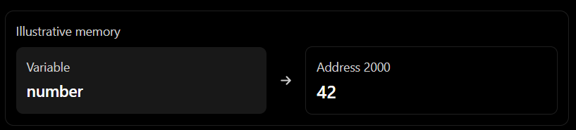

The variable's value is 42. its address is 2000. These are different things

C provides the address-of  operator &:
```
printf("%p\n", (void *)&number);
```

Here, &number means "the address of number." the cast to void * is the appropriate form for printing an object pointer with %p.


### What is a pointer?
A pointer is an object whose value is an address that can designate another object or function, depending on the pointer type.

For example:
```
int number = 42;
int *ptr = &number;
```

Let's read the second line from left to right.

- int *ptr declares ptr as a pointer to an int.
- &number obtains the address of number.
- = initializes ptr with that address.

If number is at address 2000, then ptr stores that address.

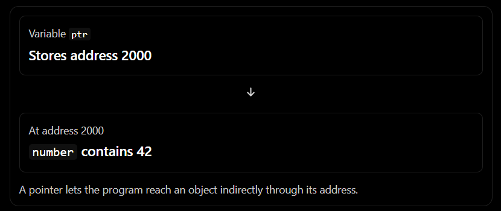

A pointer is not the value 42 in this example. It stores the address of the object that contains 42.


### What does *ptr mean?
We have now seen two operators:

- &number: obtain the address of number.
- *ptr: dereference ptr, accessing the object to which it points.

For example:
```
int number = 42;
int *ptr = &number;

printf("%d\n", *ptr);  // 42
```
The expression *ptr means, in this context, “the int object reached through the address stored in ptr.”

Now consider:
```
*ptr = 99;
```

This does not replace the pointer's stored address. It changes the value of the object to which the pointer points.

After that assignment:
```
printf("%d\n", number);  // 99
```
Why does number now contain 99? Because ptr points to number. The expression *ptr accesses the same object as the name number.

Here is the essential relationship:

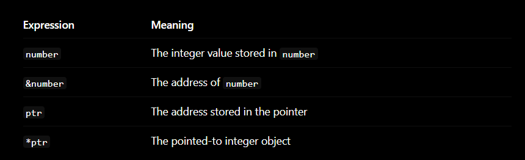


### Do not confuse the two uses of *
Look at these lines:
```
int *ptr = &number;
*ptr = 99;
```
The symbol * has two related but distinct uses.

- In a declaration, int *ptr says that ptr is a pointer to int.
- In an expression, *ptr dereferences the pointer.

That difference depends on the context in which the symbol appears.

Also remember: a pointer must contain a valid address before you dereference it. For example:
```
int *ptr;
*ptr = 99;   // Wrong: ptr was not initialized
```
Here, ptr has an indeterminate value. Dereferencing it is not valid. A pointer is not automatically initialized to point to a useful object.


## the connection between pointer and arrays

### The address of the first array element
Consider:
```
int numbers[4] = {10, 20, 30, 40};
```
We know the array contains four integers in contiguous memory.

Now look at these two expressions:
```
numbers
&numbers[0]
```

In most expressions, the array name numbers is automatically converted into a pointer to its first element. Therefore, in this context, numbers and &numbers[0] point to the same first element.

For example:
```
int *ptr = numbers;
```
This is valid C. It initializes ptr to point to numbers[0].

Compare it with:
```
int *ptr = &numbers[0];
```
These initializations have the same effect.

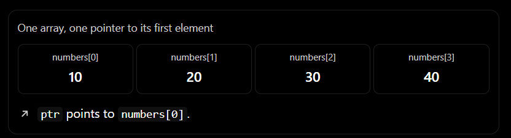

The array is still an array. The pointer is still a pointer. They are related because the array name can convert to a pointer to its first element in most expressions.

That last qualification matters: an array is not itself a pointer. We will see why shortly.


### Pointer arithmetic: moving from one element to another
Suppose:
```
int numbers[4] = {10, 20, 30, 40};
int *ptr = numbers;
```
Initially, ptr points to numbers[0].

What does this do?
```
ptr++;
```
It advances the pointer to the next int element.

It does not necessarily add one byte to the address. C pointer arithmetic scales the movement by the size of the pointed-to type.

If sizeof(int) == 4 and the first element is at illustrative address 1000, the progression looks like this:

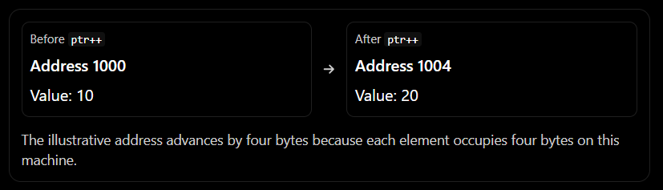

For a pointer ptr to an element of an array, these operations are meaningful:
```
ptr++;      // Advance by one int element
ptr--;      // Move back by one int element
ptr + 2;    // Pointer two int elements forward
ptr - 1;    // Pointer one int element backward
```

Pointer arithmetic is defined within an array object and permits forming a pointer one element past the end. That one-past-the-end pointer may be used for comparisons and loop termination, but must not be dereferenced.

You must not move a pointer arbitrarily outside the array's allowed range and then dereference it.


### Why does numbers[i] work?
Here is the surprising connection:
```
numbers[2]
```

is defined in C in terms of pointer arithmetic and dereferencing. The expression is equivalent to:
```
*(numbers + 2)
```

This means:

1. In this expression, numbers converts to a pointer to its first element.
2. numbers + 2 advances to the element two positions later.
3. * dereferences that pointer, accessing the element's value.

So, for this array:
```
int numbers[4] = {10, 20, 30, 40};

printf("%d\n", numbers[2]);      // 30
printf("%d\n", *(numbers + 2));  // 30
```

Both expressions access the same element.

This is one of the fundamental ideas behind arrays in C: indexing is closely connected to pointer arithmetic and dereferencing.

Let's make the equivalence more concrete.

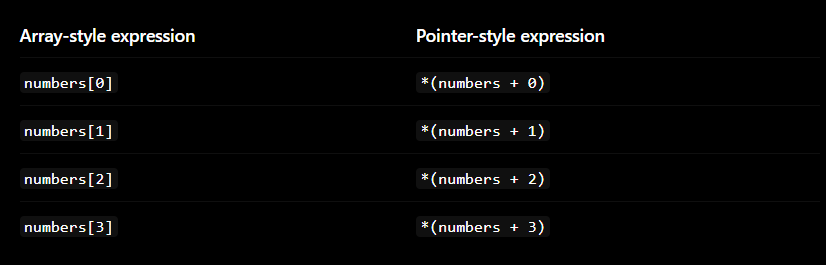

this equivalence explains why pointers are so useful for processing arrays.


### A pointer can also access and modify an array element
Because *ptr accesses the pointed-to element, it can be used on the left side of an assignment:

```
int numbers[3] = {10, 20, 30};
int *ptr = numbers;

*ptr = 99;
```

After this, numbers[0] is 99.

Now:
```
*(ptr + 1) = 55;
```
This changes numbers[1] to 55.

The array is now:
```
99, 55, 30
```
We did not need to write numbers[0] or numbers[1] directly. The pointer expressions accessed the same elements.


### Are arrays and pointers the same thing?
No. This distinction is essential.

Consider:
```
int numbers[4] = {10, 20, 30, 40};
int *ptr = numbers;
```
The array numbers is an array object containing four int elements. The pointer ptr is a separate pointer object containing the address of its first element.

This difference appears in several ways.

#### Difference 1: sizeof
```
sizeof(numbers)
```
gives the total size of the entire array object, in bytes.

If sizeof(int) == 4, the result here is 16.

But:
```
sizeof(ptr)
```
gives the size of the pointer object itself. Its size is implementation-dependent and need not equal the size of an int or of the array.

#### Difference 2: assignment

This is valid:
```
ptr = &numbers[1];
```
Now ptr points to the second element.

But this is not valid:
```
numbers = ptr;  // Invalid: arrays cannot be assigned this way
```
The array name is not an ordinary modifiable pointer variable. You cannot reassign the array itself to make it refer to a different block of memory.

#### Difference 3: incrementing

This is valid:
```
ptr++;
```
But this is not valid:
```
numbers++;  // Invalid
```
You can change the pointer variable, but you cannot increment the array name.


### What happens when an array is passed to a function?
Suppose we want a function that prints the elements of an array.
```
#include <stdio.h>

void printNumbers(int values[], int count)
{
    for (int i = 0; i < count; i++) {
        printf("%d\n", values[i]);
    }
}

int main(void)
{
    int numbers[4] = {10, 20, 30, 40};

    printNumbers(numbers, 4);

    return 0;
}
```

This code illustrates an important C rule: an array parameter declaration such as int values[] is adjusted to a pointer parameter, int *values.

That means the function does not receive a complete copy of the array object just because its parameter is written with brackets. It receives a pointer to the first element.

The function also receives count, because the pointer by itself does not tell the function how many elements are available.

These two declarations are equivalent as function parameter declarations:
```
void printNumbers(int values[], int count);
void printNumbers(int *values, int count);
```
Inside the function, values[i] works using the same indexing rule we learned earlier.

There is a consequence: inside printNumbers, sizeof(values) gives the size of a pointer, not the total size of the original array. That is why passing the element count separately is a common and useful C convention.


## Array length, variable-length arrays, and memory-safety

### How do we determine an array's length?
For an actual array object available in the same scope, a common C technique is:
```
int numbers[] = {10, 20, 30, 40};

size_t count = sizeof(numbers) / sizeof(numbers[0]);
```

You need <stddef.h> if you want to explicitly include the definition of size_t.

Why does this work?

- sizeof(numbers) gives the total size of the array in bytes.
- sizeof(numbers[0]) gives the size of one element in bytes.
- Dividing the total size by the element size gives the number of elements.

For example, if the four integers occupy 16 bytes in total and each integer occupies four bytes:

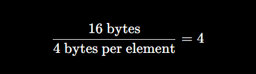

This technique works for a real array object in a scope where it has not already been converted to a pointer. It does not work the same way for an array parameter, because an array parameter is adjusted to a pointer parameter.


### Fixed-size arrays versus variable-length arrays
Your textbook discusses variable-length arrays as a way to make an array's size depend on a value known at runtime. 

A fixed-size array can be written as:
```
int data[10];
```
The number of elements is fixed at ten.

A variable-length array (VLA) can be written as:
```
void calculate(int len)
{
    int data[len];

    /* Work with data here. */
}
```

Here, the array's size depends on len, which is evaluated when execution reaches the declaration. The length must be valid for a VLA; a zero or negative length is not valid.

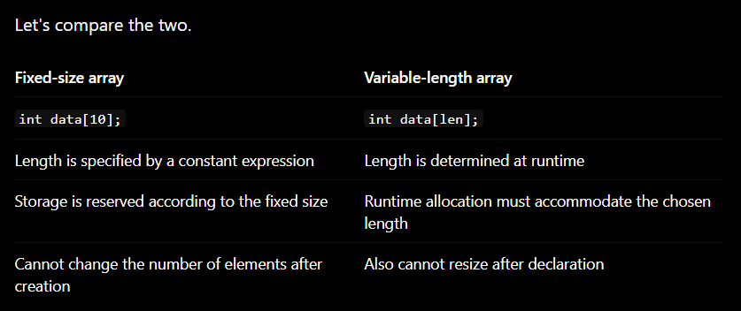

The last row deserves attention. A VLA is not a dynamically resizable array. Its length is selected when the declaration is executed; you cannot later change that existing array's length.

Also, the standard's support for VLAs varies by C version and implementation. C99 introduced them, while later C standards allow implementations to omit VLA support. Check your compiler and language mode before relying on them.


## Multidimensional arrays

### Why do we need two-dimensional arrays?
So far, our arrays have represented one sequence of values. But many real-world structures naturally have rows and columns:

- A spreadsheet has rows and columns.
- A chessboard has ranks and files.
- A digital image has rows and columns of pixels.
- A table of student marks might have students in rows and subjects in columns.

C supports multidimensional arrays.

For example:
```
int grid[3][4];
```
This declares a two-dimensional array with three rows and four columns. It contains twelve int elements in total.

The expression grid[1][2] selects the element at row index 1, column index 2—the second row and third column, because indexing starts at zero.

### Visualizing the array

Let's initialize a small two-dimensional array:
```
int grid[3][4] = {
    {1, 2, 3, 4},
    {5, 6, 7, 8},
    {9, 10, 11, 12}
};
```

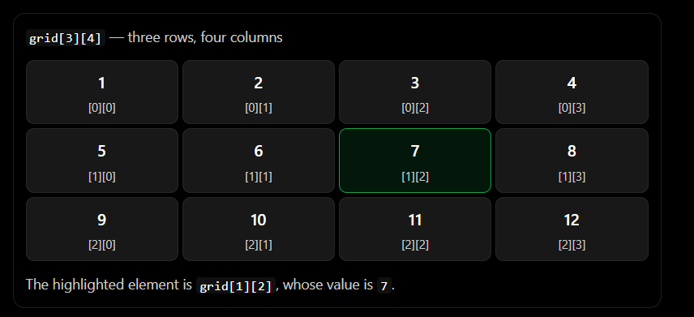

You can access or update a cell just like an element of a one-dimensional array:
```
printf("%d\n", grid[1][2]);  // 7

grid[1][2] = 99;
```
After the assignment, the selected element contains 99.


### How does a two-dimensional array fit into linear memory?
This is where the computer's view and our visual view meet.

We imagine a grid with rows and columns, but ordinary C arrays are laid out in a linear sequence of memory locations. In C, the last index changes fastest: elements in the same row are stored consecutively. This arrangement is called row-major order. 


For our array:
```
int grid[3][4] = {
    {1, 2, 3, 4},
    {5, 6, 7, 8},
    {9, 10, 11, 12}
};
```

the memory order is conceptually:
```
1 → 2 → 3 → 4 → 5 → 6 → 7 → 8 → 9 → 10 → 11 → 12
```
The first row comes first, followed by the second row, then the third row.

If the first element were at illustrative address 1000 and each int occupied four bytes, the addresses would progress like this:

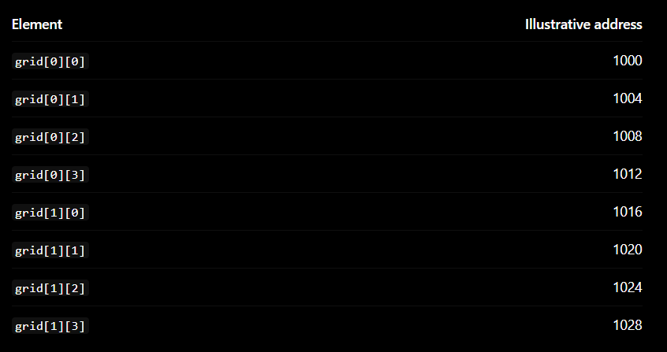

Notice the transition from grid[0][3] to grid[1][0]: the address moves directly to the next integer.

For an array with C columns, the conceptual zero-based linear element offset for row r, column c, is:
```
offset=r×C+c
```
For grid[1][2], there are four columns:
```
1×4+2=6
```
So grid[1][2] is six elements after grid[0][0]. Its illustrative address is:
```
1000+6×4=1024
```
This calculation is a useful mental model for understanding how a compiler can translate two-dimensional indexing into memory accesses.


### Nested loops for two-dimensional arrays
We can process every cell with nested loops:
```
#include <stdio.h>

int main(void)
{
    int grid[3][4] = {
        {1, 2, 3, 4},
        {5, 6, 7, 8},
        {9, 10, 11, 12}
    };

    for (int row = 0; row < 3; row++) {
        for (int col = 0; col < 4; col++) {
            printf("%d ", grid[row][col]);
        }

        printf("\n");
    }

    return 0;
}
```
The outer loop selects a row. The inner loop visits every column in that row.

The output is:
```
1 2 3 4
5 6 7 8
9 10 11 12
```
Let's trace the beginning:

- row = 0, col = 0: print grid[0][0], which is 1.
- row = 0, col = 1: print grid[0][1], which is 2.
- The inner loop continues through col = 3.
- The inner loop ends, and the newline is printed.
- The outer loop advances to row = 1; the inner loop starts again at col = 0.

The pattern is the same as a single loop, but now we are tracking two indices.


### A two-dimensional array is not an array of pointers
This is another important C distinction.
```
int grid[3][4];
```
This is an array of three elements, where each element is itself an array of four integers. It is not automatically a collection of three pointer variables.

That is why the following function declaration can accept it:
```
void printGrid(int grid[][4], int rows);
```
The parameter is adjusted to a pointer to an array of four integers. The compiler needs to know the number of columns so it can calculate the correct address for grid[row][col].

You can also write the parameter explicitly:
```
void printGrid(int (*grid)[4], int rows);
```
This says that grid is a pointer to an array of four integers.

Notice the parentheses in int (*grid)[4]. They matter because the declaration means something different from int *grid[4], which declares an array of four pointers to int.

Do not worry if that distinction feels difficult at first. The main thing to remember is that the structure of a multidimensional array affects the type of its pointer and how indexing works.